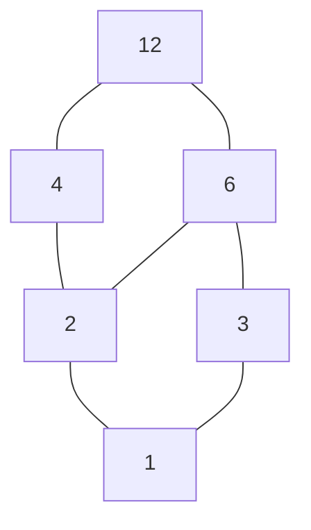

## 参考资料

- [集合 (数学) - 维基百科](<https://zh.wikipedia.org/wiki/集合_(数学)>)
- [关系 (数学) - 维基百科](<https://zh.wikipedia.org/wiki/关系_(数学)>)
- [等价关系 - 维基百科](https://zh.wikipedia.org/wiki/等价关系)
- [偏序关系 - 维基百科](https://zh.wikipedia.org/wiki/偏序关系)

## 引入

[集合](../../highschool/basic/set) 在高中已学过基础。本章在此之上引入 **二元关系**——它把「集合元素之间的联系」也当成数学对象来研究。

为什么计算机科学离不开关系？一张数据库表就是一个关系，「小于」「整除」「依赖于」「指向」全是关系，等价关系对应「分类去重」，偏序关系对应「任务调度的先后约束」。本章的两个主角——**等价关系** 与 **偏序关系**——会贯穿整个离散数学。

## 集合的进一步话题

### 集合运算

设全集为 $U$，集合 $A,B$ 的基本运算：

| 运算       | 记号           | 含义                     |
| :--------- | :------------- | :----------------------- |
| **并**     | $A\cup B$      | 在 $A$ 或在 $B$          |
| **交**     | $A\cap B$      | 既在 $A$ 又在 $B$        |
| **差**     | $A\setminus B$ | 在 $A$ 但不在 $B$        |
| **补**     | $\overline{A}$ | 在 $U$ 但不在 $A$        |
| **对称差** | $A\oplus B$    | 恰在其中一个（$=$ 异或） |

对称差 $A\oplus B=(A\setminus B)\cup(B\setminus A)$，对应逻辑里的 **异或**：元素「属于哪个集合」这件事不一致时才进来。

### 集合恒等式

集合运算与命题逻辑的联结词一一对应（$\cup\leftrightarrow\lor$、$\cap\leftrightarrow\land$、补 $\leftrightarrow\neg$），所以下面这些恒等式跟逻辑等值式长得几乎一样——它们都是 **布尔代数** 的实例。

| 名称         | 恒等式                                            |
| :----------- | :------------------------------------------------ |
| **交换律**   | $A\cup B=B\cup A$，$A\cap B=B\cap A$              |
| **结合律**   | $(A\cup B)\cup C=A\cup(B\cup C)$                  |
| **分配律**   | $A\cap(B\cup C)=(A\cap B)\cup(A\cap C)$           |
| **德摩根律** | $\overline{A\cup B}=\overline{A}\cap\overline{B}$ |
| **吸收律**   | $A\cup(A\cap B)=A$                                |
| **幂等律**   | $A\cup A=A$，$A\cap A=A$                          |

证明集合恒等式有两条路：用上面的恒等式做 **代数推导**，或用「**互相包含**」（$A\subseteq B$ 且 $B\subseteq A$）逐元素验证。

例：证 $A\setminus(B\cup C)=(A\setminus B)\cap(A\setminus C)$。把差写成「与补的交」$A\setminus B=A\cap\overline B$，再算：

$$
\begin{aligned}
A\setminus(B\cup C)
&=A\cap\overline{B\cup C}\\
&=A\cap(\overline B\cap\overline C) &&\text{德摩根律}\\
&=(A\cap\overline B)\cap(A\cap\overline C) &&\text{用了 }A\cap A=A\\
&=(A\setminus B)\cap(A\setminus C)
\end{aligned}
$$

每一步都对应一条逻辑等值式——「$x\in$」翻译过去就是命题逻辑的化简，这再次印证集合代数与逻辑同构。

### 容斥原理

计数时常用 **容斥原理**（Inclusion–Exclusion Principle），它修正了「直接相加会把交集多算一遍」：

$$
|A\cup B|=|A|+|B|-|A\cap B|
$$

$$
|A\cup B\cup C|=|A|+|B|+|C|-|A\cap B|-|A\cap C|-|B\cap C|+|A\cap B\cap C|
$$

例：$1\sim 100$ 中能被 $2$、$3$、$5$ 至少一个整除的数有多少个？设 $A,B,C$ 分别是其倍数集，逐项用 $\lfloor 100/k\rfloor$ 数个数：

$$
\begin{aligned}
&|A|=50,\ |B|=33,\ |C|=20,\\
&|A\cap B|=\lfloor100/6\rfloor=16,\ |A\cap C|=\lfloor100/10\rfloor=10,\ |B\cap C|=\lfloor100/15\rfloor=6,\\
&|A\cap B\cap C|=\lfloor100/30\rfloor=3.
\end{aligned}
$$

代入容斥：$50+33+20-16-10-6+3=74$。于是不能被 $2,3,5$ 任何一个整除的有 $100-74=26$ 个——这正是筛法（如埃氏筛、欧拉函数计算）背后的计数原理。

### 幂集

集合 $A$ 的 **所有子集** 构成的集合称 **幂集**（Power Set）：

$$
\mathcal{P}(A)=\set{B\mid B\subseteq A}
$$

若 $|A|=n$，则 $|\mathcal{P}(A)|=2^n$。直觉：每个元素都面临「选或不选」两种独立选择，$n$ 个元素就是 $2^n$ 种组合，这也正好对应一个 $n$ 位二进制串。

### 笛卡尔积

**笛卡尔积**（Cartesian Product）由所有 **有序对** 组成：

$$
A\times B=\set{(a,b)\mid a\in A,b\in B}
$$

性质：$|A\times B|=|A|\cdot|B|$。注意 **有序**，所以一般 $A\times B\ne B\times A$。

可推广到 $n$ 元：$A_1\times\dots\times A_n$ 的元素是 $n$ 元组。$\mathbb{R}\times\mathbb{R}=\mathbb{R}^2$ 就是平面坐标系，关系正是建立在笛卡尔积之上的。

## 二元关系

### 定义

$A$ 到 $B$ 的 **二元关系**（Binary Relation）$R$ 就是 $A\times B$ 的一个子集——它从所有可能的「配对」里挑出真正「有关系」的那些。若 $(a,b)\in R$，写作 $aRb$。

特别地，$A$ 到自身的关系 $R\subseteq A\times A$ 称为 $A$ 上的关系，这是本章重点。

几个特殊关系：**空关系** $\varnothing$、**全域关系** $A\times A$、**恒等关系** $I_A=\set{(a,a)\mid a\in A}$。

### 表示

同一个关系有三种等价表示，换着用能让不同性质一目了然：

| 方式         | 含义                                              |
| :----------- | :------------------------------------------------ |
| **集合表示** | 列出所有有序对 $(a,b)\in R$                       |
| **关系矩阵** | $M_R=(m_{ij})$，$a_iRa_j$ 时 $m_{ij}=1$，否则 $0$ |
| **关系图**   | 顶点为元素，$aRb$ 时画有向边 $a\to b$             |

关系矩阵是 $0/1$ 方阵，把关系的性质变成了矩阵特征；关系图则把关系变成 **有向图**，于是图论的工具立刻能拿来用。

### 性质

设 $R$ 为 $A$ 上的关系，五条核心性质：

| 名称       | 定义                          | 关系矩阵表现                     |
| :--------- | :---------------------------- | :------------------------------- |
| **自反**   | $\forall a\in A,\ aRa$        | 主对角线全 $1$                   |
| **反自反** | $\forall a\in A,\ \neg(aRa)$  | 主对角线全 $0$                   |
| **对称**   | $aRb\Rightarrow bRa$          | 矩阵关于主对角线对称             |
| **反对称** | $aRb\land bRa\Rightarrow a=b$ | 对称位置不同时为 $1$             |
| **传递**   | $aRb\land bRc\Rightarrow aRc$ | $M_R^2$ 为 $1$ 处 $M_R$ 也为 $1$ |

:::tip

**「反」不是「否定」**，这是最常见的坑：

- 「反自反」要求 **每个** 元素都不自反，不是「不是自反」。存在既不自反也不反自反的关系，如 $\set{(1,1),(2,3)}$——$1$ 自反而 $2$ 不自反。
- 「反对称」也不是「对称」的否定。$\le$ 既反对称（$a\le b\le a\Rightarrow a=b$）又不对称；恒等关系 $I_A$ 则同时是对称和反对称。

:::

#### 判定五性质算例

例：在 $A=\set{1,2,3}$ 上取关系 $R=\set{(1,1),(2,2),(3,3),(1,2),(2,3),(1,3)}$，逐条核对：

- **自反**：$(1,1),(2,2),(3,3)$ 都在，是。
- **反自反**：主对角线非空，不是。
- **对称**：有 $(1,2)$ 却无 $(2,1)$，不是。
- **反对称**：所有 $a\ne b$ 的对（$(1,2),(2,3),(1,3)$）反向都不在，是。
- **传递**：$(1,2),(2,3)$ 在且 $(1,3)$ 在；其余成对的也都补齐了，是。

所以 $R$ 同时自反、反对称、传递——它正是 $A$ 上的 **偏序**（其实就是 $\le$）。

例：给关系矩阵

$$
M_R=\begin{pmatrix}1&1&0\\1&1&1\\0&1&1\end{pmatrix}
$$

判性质。主对角线全 $1$ 故 **自反**；矩阵关于主对角线对称（$m_{ij}=m_{ji}$）故 **对称**；但传递不成立——$(1,2),(2,3)$ 为 $1$（即 $1\to2\to3$）却 $m_{13}=0$，缺 $(1,3)$。所以它自反、对称、不传递，离等价关系只差传递这一步。

## 关系的运算

### 复合

关系 $R\circ S$ 表示「先按 $R$ 走一步、再按 $S$ 走一步」能到达的配对：

$$
R\circ S=\set{(a,c)\mid \exists b,\ (a,b)\in R\land(b,c)\in S}
$$

在关系矩阵下，复合恰好对应 **布尔矩阵乘法**（把乘法换成 $\land$、加法换成 $\lor$）：$M_{R\circ S}=M_R\cdot M_S$。这也解释了为什么传递性能用矩阵幂来检验。

### 逆

把每个有序对反过来，得到 **逆关系**：

$$
R^{-1}=\set{(b,a)\mid (a,b)\in R}
$$

关系矩阵上就是转置 $M_{R^{-1}}=M_R^{\mathsf{T}}$。「对称」用逆来说就是 $R=R^{-1}$。

### 闭包

**闭包**（Closure）是「**包含 $R$、且具备某性质的最小关系**」——直觉是「为了让 $R$ 拥有某性质，最少还得补哪些对」。

- **自反闭包** $r(R)=R\cup I_A$：补上所有缺的自环。
- **对称闭包** $s(R)=R\cup R^{-1}$：每条边都补上反向。
- **传递闭包** $t(R)=R\cup R^2\cup R^3\cup\dots$：一直补到「能间接到达就直接连上」。

传递闭包对有限集 $|A|=n$ 时到 $R^n$ 为止即可，因为任意可达路径长度不超过 $n-1$。**Warshall 算法** 把这件事做得很高效：依次让每个顶点 $k$ 充当「中转站」，若 $i\to k$ 且 $k\to j$ 就补上 $i\to j$，三重循环 $O(n^3)$ 算出整张可达表。它本质上就是图论里求传递可达性的标准做法。

#### 求闭包算例

例：$A=\set{1,2,3}$ 上 $R=\set{(1,2),(2,3)}$，求三种闭包。

- **自反闭包** $r(R)=R\cup I_A=\set{(1,1),(2,2),(3,3),(1,2),(2,3)}$，补上三个自环。
- **对称闭包** $s(R)=R\cup R^{-1}=\set{(1,2),(2,1),(2,3),(3,2)}$，每条边补反向。
- **传递闭包** $t(R)$：$R$ 里有 $1\to2\to3$，补上 $(1,3)$，得 $\set{(1,2),(2,3),(1,3)}$。

例：用 Warshall 逐步求上面 $R$ 的传递闭包。初始矩阵（行列序 $1,2,3$）：

$$
M^{(0)}=\begin{pmatrix}0&1&0\\0&0&1\\0&0&0\end{pmatrix}
$$

$k=1$（以 $1$ 中转）：没有任何 $i\to1$，矩阵不变。

$k=2$（以 $2$ 中转）：$1\to2$ 且 $2\to3$，补 $(1,3)$：

$$
M^{(2)}=\begin{pmatrix}0&1&1\\0&0&1\\0&0&0\end{pmatrix}
$$

$k=3$（以 $3$ 中转）：没有 $3\to j$ 的出边，矩阵不变。最终 $M^{(3)}$ 即 $t(R)$ 的矩阵，对应 $\set{(1,2),(2,3),(1,3)}$，与上面手算一致。Warshall 的妙处在于：处理完 $k$ 后，「只经过编号 $\le k$ 的中转点可达」这件事已全部记录，逐层累积到最后就是完整可达表。

## 等价关系

同时满足 **自反、对称、传递** 的关系称 **等价关系**（Equivalence Relation），常记作 $\sim$。

它抽象的是「**长得一样 / 算作同一类**」这件事：相等、同余、相似、图的同构，都是等价关系。三条性质恰好对应「分类」必须满足的常识——每个东西跟自己一类（自反）、$a$ 跟 $b$ 一类则 $b$ 跟 $a$ 一类（对称）、能传导（传递）。

### 等价类

元素 $a$ 所在的「类」就是所有跟它等价的元素：

$$
[a]_R=\set{x\in A\mid x\sim a}
$$

性质：

- $[a]_R\ne\varnothing$（至少含 $a$ 自己）。
- 两个等价类要么 **完全相等**，要么 **完全不相交**——绝不会「部分重叠」。
- 所有等价类无重叠地铺满 $A$，构成 $A$ 的 **划分**。

### 划分与对应

$A$ 的一个 **划分**（Partition）是一族非空子集 $\set{A_1,A_2,\dots}$，满足：

1. 各 $A_i\ne\varnothing$。
2. 两两不相交。
3. 并为 $A$。

每块叫一个 **等价类（块）**。核心结论：

$$
A\text{ 上的等价关系}\ \longleftrightarrow\ A\text{ 的划分}
$$

**等价关系与划分一一对应**——给定等价关系，等价类就是划分；给定划分，「同块」就定义出等价关系。所有等价类组成的集合 $A/{\sim}$ 称 **商集**，这正是编程里「去重 / 按 key 分组」背后的数学。

:::tip

模 $n$ 同余 $a\equiv b\pmod n$ 是最典型的等价关系，它把整数划分成 $n$ 个 **同余类** $[0],[1],\dots,[n-1]$。代数里的 $\mathbb{Z}_n$ 就是这个商集。

:::

#### 求等价类与商集算例

例：在 $\mathbb{Z}$ 上取模 $3$ 同余，求各等价类与商集。按余数分类：

$$
[0]=\set{\dots,-3,0,3,6,\dots},\quad
[1]=\set{\dots,-2,1,4,7,\dots},\quad
[2]=\set{\dots,-1,2,5,8,\dots}
$$

三类互不相交、并起来是整个 $\mathbb{Z}$，商集 $\mathbb{Z}/{\sim}=\set{[0],[1],[2]}$，记作 $\mathbb{Z}_3$。这正是程序里 `x % 3` 把整数分成三桶。

例：在 $A=\set{1,2,3,4,5,6}$ 上定义 $a\sim b\iff a,b$ 同奇偶。验证它自反（自己跟自己同奇偶）、对称、传递，是等价关系。等价类为

$$
[1]=\set{1,3,5},\qquad [2]=\set{2,4,6}
$$

商集 $A/{\sim}=\set{\set{1,3,5},\set{2,4,6}}$，把 $6$ 个元素分成「奇」「偶」两块——这就是按 key 分组的最小例子。

## 偏序关系

同时满足 **自反、反对称、传递** 的关系称 **偏序关系**（Partial Order），记为 $\preceq$。$(A,\preceq)$ 称 **偏序集**（Partially Ordered Set，poset）。

它抽象的是「**先后 / 大小 / 包含**」这种带方向、不能循环的次序：数的 $\le$、集合的 $\subseteq$、整除 $\mid$、任务的依赖关系都是偏序。「偏」字强调——**不要求任意两元素都可比**。如 $\set{2,3}$ 在整除关系下谁也不整除谁，没法比。

若 $a\preceq b$ 或 $b\preceq a$ 成立，称 $a,b$ **可比**；否则不可比。

### 哈斯图

画偏序集时，自反边和能由传递推出的边都是「废话」，全省掉，得到 **哈斯图**（Hasse Diagram）：

- 把元素按大小 **自下而上** 摆放，小的在下、大的在上。
- 仅当 $a\prec b$ 且二者之间 **没有中间元素**（$b$ 盖住 $a$）时，画一条 **无向连边**。

于是「谁大谁小」一眼就能看出来——往上能连到的就是更大的。整除关系 $\set{1,2,3,4,6,12}$ 的哈斯图就是 $12$ 的因子格。

#### 画哈斯图算例

例：在 $\set{1,2,3,4,6,12}$ 上画整除偏序 $\mid$ 的哈斯图。先列出「盖住」关系（$a\prec b$ 且中间无元素）：

- $1$ 之上紧邻 $2$ 和 $3$（$1\mid2$、$1\mid3$，中间无因子）。
- $2$ 之上紧邻 $4$ 和 $6$；$3$ 之上紧邻 $6$。
- $4$ 之上紧邻 $12$；$6$ 之上紧邻 $12$。

注意 $1\mid4$、$2\mid12$ 这些边都由传递推出，省略不画。自下而上分四层：$1$；$2,3$；$4,6$；$12$。连边只画上述盖住关系：

最底的 $1$ 是最小元（整除一切），最顶的 $12$ 是最大元。$2,3$ 不可比（互不整除），所以并排同层——这就是「偏」序。

### 特殊元素

设 $B\subseteq A$，区分两组容易混淆的概念：

| 名称       | 定义                                    |
| :--------- | :-------------------------------------- |
| **最大元** | $m\in B$，$\forall x\in B,\ x\preceq m$ |
| **最小元** | $m\in B$，$\forall x\in B,\ m\preceq x$ |
| **极大元** | $m\in B$，不存在 $x\in B$ 使 $m\prec x$ |
| **极小元** | $m\in B$，不存在 $x\in B$ 使 $x\prec m$ |
| **上界**   | $u\in A$，$\forall x\in B,\ x\preceq u$ |
| **下界**   | $l\in A$，$\forall x\in B,\ l\preceq x$ |
| **上确界** | 最小上界 $\sup B$                       |
| **下确界** | 最大下界 $\inf B$                       |

:::tip

**最大元 vs 极大元** 是必考的细微差别：

- **最大元** 要「比 **所有** 人都大」，所以一旦存在必 **唯一**。
- **极大元** 只要「**没人比它大**」，可以有多个——互不可比的几个顶端元素都是极大元。

在 $\set{2,3,4,9}$ 的整除偏序里，$4$ 和 $9$ 都是极大元（谁也整除不了它们），但没有最大元（$4,9$ 不可比）。**有限非空偏序集一定有极大元，未必有最大元。** 上 / 下界要到 $A$ 里找，可能不在 $B$ 内。

:::

### 全序与良序

- **全序（线序）**：任意两元素都可比。此时哈斯图是一条链，如 $(\mathbb{R},\le)$。
- **良序**：任一 **非空子集** 都有最小元。

良序集是 **数学归纳法** 的根基——正因为 $\mathbb{N}$ 的每个非空子集都有最小元，「最小反例」式的反证才成立。

## 函数

**函数**（Function）是一类特殊的关系：从 $A$ 到 $B$ 的关系 $f$，若 **每个** $a\in A$ 恰好对应 **唯一** 的 $b\in B$，就是函数 $f:A\to B$。换句话说，函数是「左全（每个输入都有输出）且右唯一（输出不分叉）」的关系。

### 三种基本性质

| 名称     | 定义                                  | 直觉             |
| :------- | :------------------------------------ | :--------------- |
| **单射** | $f(a_1)=f(a_2)\Rightarrow a_1=a_2$    | 不同输入不撞输出 |
| **满射** | $\forall b\in B,\ \exists a,\ f(a)=b$ | 值域铺满整个 $B$ |
| **双射** | 既单射又满射                          | 一一对应、可逆   |

只有 **双射** 才有 **逆函数** $f^{-1}$，满足 $f^{-1}\circ f=I_A$。复合函数 $g\circ f$ 表示先作用 $f$ 再作用 $g$，其单 / 满 / 双性可由 $f,g$ 推出（如两个双射复合仍双射）。

#### 判性质与求复合、逆算例

例：判断 $f:\mathbb{R}\to\mathbb{R}$，$f(x)=2x+1$ 的性质并求逆。

- **单射**：$2x_1+1=2x_2+1\Rightarrow x_1=x_2$，是。
- **满射**：任给 $y$，解 $2x+1=y$ 得 $x=(y-1)/2\in\mathbb{R}$，是。

故 $f$ 双射，逆函数 $f^{-1}(y)=\dfrac{y-1}{2}$。验证 $f^{-1}(f(x))=\dfrac{(2x+1)-1}{2}=x$，确为恒等。

例：在有限集上看复合。$f:\set{1,2,3}\to\set{a,b,c}$，$f=\set{(1,b),(2,a),(3,c)}$；$g:\set{a,b,c}\to\set{x,y,z}$，$g=\set{(a,y),(b,x),(c,z)}$。复合 $g\circ f$（先 $f$ 后 $g$）逐点算：$1\mapsto b\mapsto x$、$2\mapsto a\mapsto y$、$3\mapsto c\mapsto z$，即 $g\circ f=\set{(1,x),(2,y),(3,z)}$。$f,g$ 都是双射，复合也是双射。

例：$f:\mathbb{R}\to\mathbb{R}$，$f(x)=x^2$ 既非单射（$f(-1)=f(1)$）又非满射（取不到负值），所以不可逆。但若把定义域、值域都限到 $[0,\infty)$，它就成了双射，逆为 $\sqrt{\cdot}$——这说明单 / 满 / 双 **依赖于定义域和陪域的选取**，不只看表达式。

### 基数与可数性

双射给了我们 **比较集合大小** 的统一办法：两个集合之间存在双射，就称它们 **等势**，记 $|A|=|B|$。对有限集这就是数个数；对无限集，它揭示出「无穷也分大小」。

- **可数集**（Countable）：与 $\mathbb{N}$ 等势的无限集，能「排成一列编号」。$\mathbb{Z}$、$\mathbb{Q}$ 都可数——有理数虽然稠密，却能巧妙地排成一列。
- **不可数集**：如 $\mathbb{R}$。**康托尔对角线法**（Cantor's Diagonal Argument）证明实数无法排成一列，于是 $|\mathbb{R}|>|\mathbb{N}|$。

:::tip

可数性不是闲谈：它告诉我们 **程序的数量是可数的**（每个程序是有限字符串），而 **函数的数量是不可数的**——所以必然存在「写不出程序来计算」的函数。这正是不可计算性、停机问题的起点。

:::
