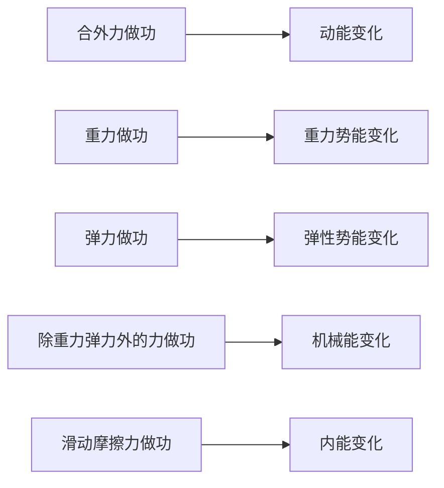

## 机械能守恒定律

### 功

力对物体做的功，等于力的大小、位移大小以及二者夹角余弦的乘积：

$$W=Fl\cos\alpha$$

- $\alpha$ 是力 $\vec F$ 与位移 $\vec l$ 的夹角；功是 **标量**，单位焦耳（$\mathrm{J}$）；
- $\alpha<90^\circ$，$W>0$，力做正功（动力）；
- $\alpha=90^\circ$，$W=0$，力不做功；
- $\alpha>90^\circ$，$W<0$，力做负功（阻力），或说物体克服该力做功。

几个力共同作用时，**总功** 等于各力做功的代数和，也等于合力做的功：

$$W_{\text{总}}=W_1+W_2+\dots=F_{\text{合}}l\cos\alpha$$

比较两个功的大小，默认比较绝对值：$-5\ \mathrm{J}$ 比 $-3\ \mathrm{J}$「做功更多」。

**变力做功** 有几种常用的化归方法：

- **力向位移**：恒力做功只与位移在力方向上的投影有关，$W=Fl_F$（$l_F$ 为「力向位移」，可正可负）。求重力做功时，无论路径如何，只看竖直高度差 $h$，$W_G=\pm mgh$；
- **大小恒定、方向与运动夹角恒定**：如滑动摩擦力，$W=Fl\cos\theta$，其中 $l$ 是 **路径长度** 而非位移。物体先右滑 $3\ \mathrm{m}$ 再左滑 $2\ \mathrm{m}$，摩擦力做功要代入总路程 $5\ \mathrm{m}$，不是净位移；
- **$F\text{-}x$ 图像**：图线与 $x$ 轴围成的「有向面积」即为变力做的功，$x$ 轴上方取正、下方取负。

**斜面上的滑动摩擦等效**：物体在倾角 $\theta$、粗糙的斜面上下滑，摩擦力 $f=\mu mg\cos\theta$，沿斜长 $L$ 做功 $W=-\mu mg\cos\theta\cdot L$。由 $L\cos\theta=x$（$x$ 为水平宽度）得：

$$W=-\mu mgx$$

即滑动摩擦做功只与 **水平距离** 有关，与斜面倾角无关——从等高的不同斜面滑下，克服摩擦做的功相同。

### 功率

功率描述做功的快慢，等于功与所用时间之比，单位瓦特（$\mathrm{W}$）。

$$P=\frac{W}{t}$$

上式为 **平均功率**。**瞬时功率** 等于力与瞬时速度的乘积：

$$P=Fv\cos\alpha$$

其中 $\alpha$ 为力与速度的夹角。当力与速度同向时 $P=Fv$。

**机车启动** 两种模型：

- **恒定功率启动**：$P$ 不变，$F=\frac{P}{v}$，速度增大则牵引力减小，做加速度减小的加速运动，最终达最大速度 $v_{\max}=\frac{P}{f}$（$f$ 为阻力）；
- **恒定牵引力启动**：$F$ 不变，先匀加速，功率随速度增大至额定功率后转为恒功率加速，最终同样达 $v_{\max}=\frac{P}{f}$。

无论哪种模型，最大速度都在 $F=f$（合力为零、加速度为零）时取得。

### 动能与动能定理

**动能**：物体由于运动而具有的能量，与质量、速度有关：

$$E_k=\frac{1}{2}mv^2$$

**动能定理**：合外力对物体做的总功，等于物体动能的变化量。

$$W_{\text{总}}=E_{k2}-E_{k1}=\frac{1}{2}mv_2^2-\frac{1}{2}mv_1^2$$

- 动能定理是标量方程，不涉及方向，处理变力做功、曲线运动尤其方便；
- $W_{\text{总}}$ 为所有外力做功的代数和，包括重力、摩擦力、拉力等，切勿只代入其中一个力；
- 只关心始末状态的动能，与中间过程无关，是解题的有力工具。

选取哪一段运动列动能定理，看已知与所求：求某点的速度，选从一个已知速度的点到该点；求某段的信息，选两端速度都已知的段，这一段不必恰好是问题的端点，可以是包含它的更大一段。

:::example

质量 $m$ 的物体以初速度 $v_0$ 冲上倾角 $\theta$ 的斜面，与斜面间动摩擦因数为 $\mu$，求沿斜面上滑的最大距离 $s$。

上滑过程受重力沿斜面分量 $mg\sin\theta$ 与摩擦力 $\mu mg\cos\theta$，方向均与运动相反。末状态速度为零，由动能定理：

$$-(mg\sin\theta+\mu mg\cos\theta)s=0-\frac{1}{2}mv_0^2$$

解得 $s=\frac{v_0^2}{2g(\sin\theta+\mu\cos\theta)}$。全程只需列始末状态，无需分段分析。

:::

### 重力势能

物体由于被举高而具有的能量，等于重力与高度的乘积：

$$E_p=mgh$$

- 重力势能是 **相对量**，$h$ 从选定的 **参考平面** 量起，可正可负；
- 势能差与参考面选取无关，只与始末位置有关；
- **重力做功** 只与始末位置的高度差有关，与路径无关：

$$W_G=mgh_1-mgh_2=-\Delta E_p$$

重力做正功，重力势能减小；重力做负功，重力势能增大。重力势能是物体与地球共有的。

**弹性势能**：发生弹性形变的物体具有的能量。同一弹簧形变量越大，弹性势能越大；弹簧被拉伸或压缩，弹性势能都增大。弹力做正功时弹性势能减小，做负功时增大，与重力势能规律一致。中学阶段不要求弹性势能的具体表达式，只作定性分析。

重力、弹力都是 **保守力**：它们做功只取决于始末位置，与路径无关，因而能定义出对应的势能。摩擦力则不然，做功与路径长度有关，是非保守力，没有对应的势能。

### 机械能守恒定律

**动能与势能**（重力势能、弹性势能）之和称 **机械能**。

**机械能守恒定律**：在只有重力（或弹力）做功的情形下，物体的动能与势能可以相互转化，而 **机械能的总量保持不变**。

$$E_{k1}+E_{p1}=E_{k2}+E_{p2}$$

即 $\frac{1}{2}mv_1^2+mgh_1=\frac{1}{2}mv_2^2+mgh_2$。也可写成「减少的势能等于增加的动能」：

$$\Delta E_k=-\Delta E_p$$

机械能守恒有三种等价表达，按题目条件择一使用：

- **守恒式**：$E_{k1}+E_{p1}=E_{k2}+E_{p2}$，直接列始末两状态的总机械能相等；
- **转化式**：$\Delta E_k=-\Delta E_p$，减少的势能等于增加的动能；
- **转移式**：$\Delta E_A=-\Delta E_B$，系统内 A 减少的机械能等于 B 增加的机械能（用于连接体）。

守恒条件的判断：

- **只有重力或系统内弹力做功**，其他力（如摩擦力、空气阻力）不做功或不存在；
- 有重力和弹力以外的力做功，机械能不守恒；
- 判断时看是否有摩擦、拉力、阻力等做功，而非看物体是否受这些力；
- 绳、杆连接的系统内，绳（杆）的弹力对整个系统做功之和为零，不破坏系统机械能守恒。

:::example

自由落体、平抛、光滑斜面下滑、单摆摆动、竖直平面内光滑圆轨道运动，都满足机械能守恒。选参考面后对始末两状态列守恒方程即可，无需分析中间过程。

:::

### 功能关系与能量守恒

功是能量转化的量度：某种力做功，对应某种能量的变化。

|          力做功          |                       对应能量变化                        |
| :----------------------: | :-------------------------------------------------------: |
|       合外力做的功       |         等于动能的变化 $W_{\text{合}}=\Delta E_k$         |
|        重力做的功        |        等于重力势能变化的相反数 $W_G=-\Delta E_p$         |
|        弹力做的功        |                 等于弹性势能变化的相反数                  |
| 除重力、弹力外的力做的功 |  等于机械能的变化 $W_{\text{其他}}=\Delta E_{\text{机}}$  |
|      滑动摩擦力做功      | 与相对滑动路程相关，摩擦生热 $Q=F_f\cdot s_{\text{相对}}$ |

「除重力、弹力外的力做的功等于机械能的变化」是 **功能原理**，比机械能守恒更普适：这些力做正功则机械能增加，做负功则机械能减少，做功为零才守恒——守恒只是它的特例。

**能量守恒定律**：能量既不会凭空产生，也不会凭空消失，只能从一种形式转化为另一种形式，或从一个物体转移到另一个物体，总量保持不变。它是自然界最普遍的规律之一。

各种功与能量变化的对应关系可归结如下：

一对滑动摩擦力做功之和为负，等于系统减少的机械能，这部分机械能转化为内能：$Q=F_f\cdot s_{\text{相对}}$，其中 $s_{\text{相对}}$ 为两物体间的相对滑动路程。注意这里用的是 **相对滑动路程**，而非某个物体对地的位移——一对静摩擦力做功之和恒为零，只有相对滑动才生热。

## 动量守恒定律

### 动量与冲量

#### 动量

- **动量**（Momentum）：物体质量与速度的乘积，用 $p$ 表示；
- 定义式 $p=mv$，单位 $\text{kg}\cdot\text{m/s}$；
- 动量是 **矢量**，方向与速度方向相同；
- 动量的变化 $\Delta p=p'-p$ 也是矢量，一维情况下先规定正方向，再按代数值计算。

动量与动能的区别：动能 $E_k=\frac{1}{2}mv^2$ 是标量，恒为正；动量是矢量，方向随速度改变。二者关系为 $E_k=\frac{p^2}{2m}$。

|          |      动量 $p$      |      动能 $E_k$       |
| :------: | :----------------: | :-------------------: |
|  表达式  |       $p=mv$       | $E_k=\frac{1}{2}mv^2$ |
|  矢标性  |        矢量        |         标量          |
| 变化条件 | 速度大小或方向改变 |    仅速度大小改变     |

匀速圆周运动的物体，速率不变、动能不变，但速度方向时刻改变，**动量一直在变**。

#### 冲量

- **冲量**（Impulse）：力与作用时间的乘积，用 $I$ 表示；
- 恒力的冲量 $I=Ft$，单位 $\text{N}\cdot\text{s}$；
- 冲量是 **矢量**，方向与力的方向相同（恒力情况下）；
- $\text{N}\cdot\text{s}$ 与 $\text{kg}\cdot\text{m/s}$ 是同一单位，$1\ \text{N}\cdot\text{s}=1\ \text{kg}\cdot\text{m/s}$。

冲量描述力对时间的 **累积效应**。变力冲量一般用动量定理反求，也可用「$F$–$t$ 图像与时间轴围成的面积」求恒力或线性变力的冲量。

重力的冲量恒为 $mgt$，方向竖直向下，与运动路径无关。

### 动量定理

#### 内容与表达式

**动量定理**：物体所受合外力的冲量等于它动量的变化量。

$$Ft=mv'-mv=\Delta p$$

- 合外力冲量与动量变化量 **大小相等、方向相同**；
- 是矢量式，一维问题先定正方向再代入正负；
- 对变力同样成立，此时 $F$ 取平均力或用面积法处理。

动量定理揭示了 **力在时间上的累积** 改变动量。它与牛顿第二定律等价：由 $F=ma=m\frac{\Delta v}{\Delta t}$ 变形即得 $Ft=m\Delta v$。

#### 应用

- **求变力冲量或平均力**：碰撞、打击时间极短、力很大且变化复杂，用动量定理避开瞬时受力分析；
- **缓冲减力**：动量变化一定时，延长作用时间 $t$ 可减小平均力 $F$。跳高垫、汽车缓冲区、缓冲包装都据此设计；
- **增大冲力**：缩短作用时间可增大冲力，如锤子敲击、快速冲压。

:::example

质量 $m=0.5\ \text{kg}$ 的球以 $v=6\ \text{m/s}$ 竖直下落，与地面碰撞后以 $4\ \text{m/s}$ 反弹，接触时间 $t=0.02\ \text{s}$。取向上为正，求地面对球的平均作用力。

碰撞前动量 $p=-mv=-3\ \text{kg}\cdot\text{m/s}$，碰后 $p'=mv'=2\ \text{kg}\cdot\text{m/s}$。

对球用动量定理（合力为地面支持力 $N$ 与重力 $mg$）：

$$(N-mg)t=p'-p$$

代入得 $N=\frac{p'-p}{t}+mg=\frac{5}{0.02}+5=255\ \text{N}$。

:::

### 动量守恒定律

#### 内容与条件

**动量守恒定律**：一个系统不受外力或所受外力之和为零，系统的总动量保持不变。

对两个物体组成的系统：

$$m_1v_1+m_2v_2=m_1v_1'+m_2v_2'$$

守恒条件（满足其一即可）：

- **不受外力**，或所受外力的合力为零；
- 系统所受外力远小于内力（碰撞、爆炸的瞬间），可近似守恒；
- 某方向合外力为零，则该方向动量守恒（如水平方向）。

**内力** 只在系统内部相互作用，不改变系统总动量；**外力** 才可能改变总动量。碰撞中内力（相互作用力）远大于重力、摩擦力等外力，故动量近似守恒。

#### 守恒的判断

|           情形           |     是否守恒     |
| :----------------------: | :--------------: |
|  光滑水平面上两物体碰撞  |       守恒       |
|  竖直方向碰撞（含重力）  | 短时间内近似守恒 |
| 系统受恒定摩擦但内力极大 |     近似守恒     |
|     某方向合外力为零     |    该方向守恒    |

应用步骤：选系统与研究过程、规定正方向、写出碰前碰后各物体动量、列守恒方程求解。**方向** 是易错点，反向速度必须代负值。

### 碰撞、反冲与爆炸

#### 碰撞的分类

碰撞过程动量守恒。按动能是否损失分类：

|      类型      | 动量 |   动能   |          特点          |
| :------------: | :--: | :------: | :--------------------: |
|    弹性碰撞    | 守恒 |   守恒   | 碰后分开，无机械能损失 |
|   非弹性碰撞   | 守恒 | 部分损失 |        一般碰撞        |
| 完全非弹性碰撞 | 守恒 | 损失最大 |    碰后粘在一起共速    |

**一维弹性碰撞** 联立动量守恒与动能守恒：

$$
\begin{cases}
  m_1v_1+m_2v_2=m_1v_1'+m_2v_2' \\
  \frac{1}{2}m_1v_1^2+\frac{1}{2}m_2v_2^2=\frac{1}{2}m_1v_1'^2+\frac{1}{2}m_2v_2'^2
\end{cases}
$$

设 $m_2$ 初始静止（$v_2=0$），解得：

$$
\begin{aligned}
  v_1' & =\frac{m_1-m_2}{m_1+m_2}v_1 \\
  v_2' & =\frac{2m_1}{m_1+m_2}v_1
\end{aligned}
$$

由此看几种特例：

- $m_1=m_2$：$v_1'=0$、$v_2'=v_1$，**交换速度**；
- $m_1\gg m_2$：$v_1'\approx v_1$、$v_2'\approx 2v_1$，大球几乎不变、小球以近两倍速度弹出；
- $m_1\ll m_2$：$v_1'\approx-v_1$、$v_2'\approx 0$，小球原速率反弹、大球几乎不动。

**完全非弹性碰撞** 碰后共速 $v$：

$$v=\frac{m_1v_1+m_2v_2}{m_1+m_2}$$

碰撞的合理性检验：碰后不能出现「后面的物体速度大于前面的物体」这类穿越，且系统动能不能增加。

#### 反冲与爆炸

- **反冲**：系统某部分向一方运动，另一部分向反方向运动，总动量守恒。火箭、反冲小车、发射炮弹都是反冲；
- **爆炸**：内力（爆炸力）远大于外力，动量守恒；爆炸释放化学能，系统动能 **增大**。

火箭靠向后高速喷气获得向前的动量。设初始总动量为零，喷气动量与箭体动量大小相等、方向相反：

$$m_{\text{气}}v_{\text{气}}=m_{\text{箭}}v_{\text{箭}}$$

爆炸问题：爆炸前后动量守恒，但动能因释放能量而增加，不能用动能守恒。

## 必记公式表

|   物理量   |                        公式                         |          说明          |
| :--------: | :-------------------------------------------------: | :--------------------: |
|     功     |                  $W=Fl\cos\alpha$                   |          标量          |
|  瞬时功率  |                  $P=Fv\cos\alpha$                   | 力与速度夹角 $\alpha$  |
|    动能    |                $E_k=\frac{1}{2}mv^2$                |          标量          |
|  动能定理  | $W_{\text{总}}=\frac{1}{2}mv_2^2-\frac{1}{2}mv_1^2$ |   处理变力、曲线运动   |
|  重力势能  |                      $E_p=mgh$                      |       相对参考面       |
| 机械能守恒 |  $\frac{1}{2}mv_1^2+mgh_1=\frac{1}{2}mv_2^2+mgh_2$  |  只有重力 / 弹力做功   |
|    动量    |                       $p=mv$                        |    矢量，方向同速度    |
|    冲量    |                       $I=Ft$                        |       恒力，矢量       |
|  动量定理  |                     $Ft=mv'-mv$                     | 合外力冲量等于动量变化 |
|  动量守恒  |           $m_1v_1+m_2v_2=m_1v_1'+m_2v_2'$           |       合外力为零       |
