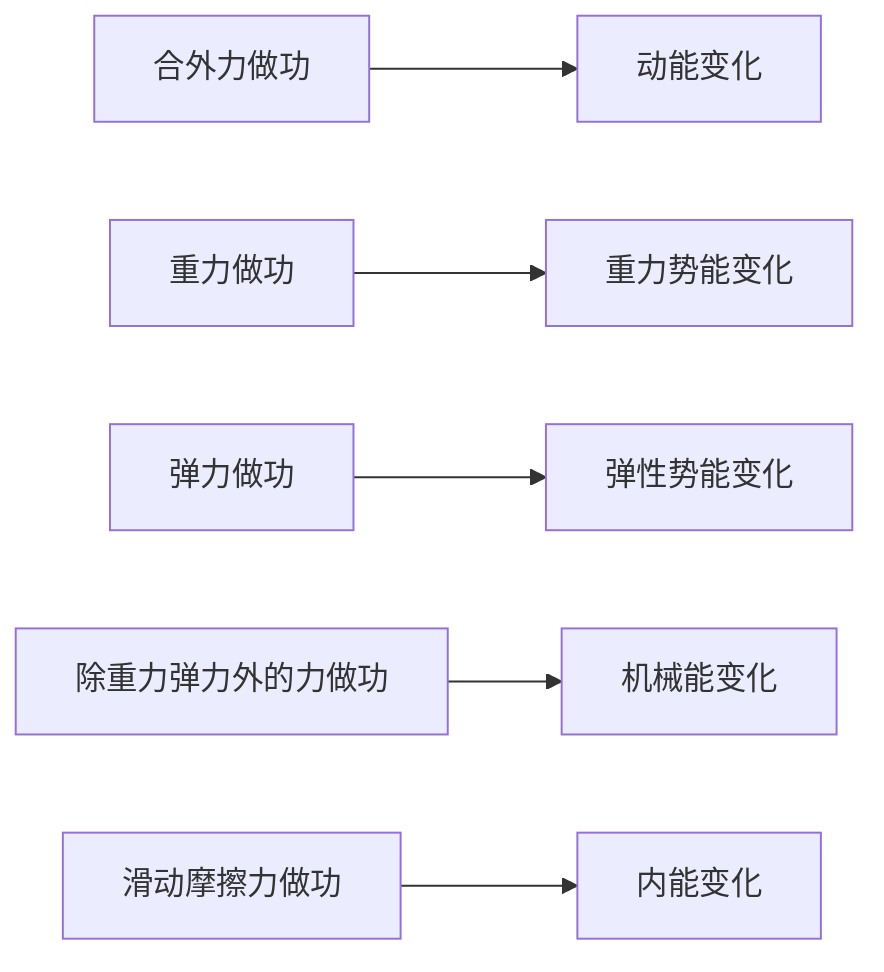

物理学考 / 选考笔记，对应人教版《必修第二册》，按专题整理。

## 第五章 抛体运动

### 曲线运动

物体运动轨迹为曲线的运动。物体做曲线运动时，**速度方向沿轨迹的切线方向**，时刻改变，故曲线运动一定是变速运动，一定有加速度。

- 做曲线运动的条件：**合外力（加速度）方向与速度方向不在同一直线上**；
- 合力指向轨迹凹侧，速度、合力、轨迹三者「速度居中、合力偏向凹侧」；
- 若合力方向与速度方向相同或相反，则做直线运动。

| 运动类型 |     合力与速度     |        轨迹        |
| :------: | :----------------: | :----------------: |
| 直线运动 | 共线（同向或反向） |        直线        |
| 曲线运动 |  不共线（成夹角）  | 曲线，偏向合力一侧 |

### 运动的合成与分解

一个复杂运动可看作两个（或多个）简单分运动的合成。合成与分解遵循 **平行四边形定则**（矢量运算），对位移、速度、加速度均成立。

- **等时性**：合运动与各分运动经历的时间相同；
- **独立性**：各分运动互不影响，各自独立进行；
- **等效性**：各分运动的合效果与合运动等效。

沿相互垂直的两个方向分解最常用。设合速度 $\vec v$ 分解为 $v_x$、$v_y$：

$$v=\sqrt{v_x^2+v_y^2}$$

合速度与 $x$ 轴夹角 $\theta$ 满足 $\tan\theta=\frac{v_y}{v_x}$。

判断合运动的性质，看合初速度与合加速度是否共线：两者共线做直线运动，不共线做曲线运动；合加速度恒定则为匀变速运动。

:::example

小船渡河是典型的运动合成问题。船速 $\vec v_1$（船相对静水）与水速 $\vec v_2$（水相对岸）合成为船的实际速度。设河宽为 $d$：

- **渡河时间最短**：船头正对对岸，垂直分速度最大（等于 $v_1$），$t_{\min}=\frac{d}{v_1}$，与水速无关，但会被冲向下游；
- **航程最短**（$v_1>v_2$）：合速度垂直于河岸，船头指向上游，与岸成夹角 $\theta$ 满足 $\cos\theta=\frac{v_2}{v_1}$，最短航程即河宽 $d$；
- $v_1<v_2$ 时无法垂直渡河，此时合速度方向与 $v_1$ 垂直时航程最短。

:::

### 关联速度

绳、杆连接或直接接触的物体，速度并不独立。约束限制了它们的相对运动，由此产生 **关联速度**。核心是一句话：**沿约束方向（绳、杆或接触面法线）的分速度大小相等**。

处理关联速度分三步：

- **找合速度**：物体实际运动的方向就是合速度方向（轨迹的切线）；
- **分解**：把合速度正交分解为「沿约束方向」与「垂直约束方向」两个分量；
- **建等式**：让两物体沿约束方向的分速度相等，列方程求解。

沿绳（杆）速度相等，但加速度不一定相等——夹角在变，转动效果会额外贡献法向加速度。

:::example

**人拉船靠岸**：岸上的人以速度 $v_1$ 匀速收绳，绳与水平方向夹角为 $\theta$。船的实际速度 $\vec v$ 是合速度，把它沿绳方向分解得 $v\cos\theta$。绳不可伸长，绳端沿绳的速度必须等于收绳速度：

$$v\cos\theta=v_1\implies v=\frac{v_1}{\cos\theta}$$

$\theta$ 越大，船速越大——船越靠近岸，收绳的效率越低。

:::

### 平抛运动

将物体以水平初速度 $v_0$ 抛出，只受重力作用的运动。它是 **匀变速曲线运动**，加速度恒为 $g$、方向竖直向下。

平抛运动可分解为两个独立的分运动：

- **水平方向**：匀速直线运动，速度恒为 $v_0$；
- **竖直方向**：初速度为零的自由落体运动，加速度为 $g$。

设抛出点为原点、水平为 $x$ 轴、竖直向下为 $y$ 轴，经时间 $t$：

$$
\begin{aligned}
  x & =v_0t \\
  y & =\frac{1}{2}gt^2
\end{aligned}
$$

$$
\begin{aligned}
  v_x & =v_0 \\
  v_y & =gt
\end{aligned}
$$

**合速度** 大小与方向：

$$v=\sqrt{v_x^2+v_y^2}=\sqrt{v_0^2+(gt)^2}$$

设合速度与水平方向夹角为 $\theta$，位移与水平方向夹角为 $\alpha$：

$$\tan\theta=\frac{v_y}{v_0}=\frac{gt}{v_0},\quad \tan\alpha=\frac{y}{x}=\frac{gt}{2v_0}$$

由此得 $\tan\theta=2\tan\alpha$：**速度方向与水平的夹角，其正切恒为位移方向夹角正切的两倍**。这是平抛的重要几何性质。

飞行时间只由下落高度 $h$ 决定，与初速度无关：

$$t=\sqrt{\frac{2h}{g}}$$

水平射程 $x=v_0t=v_0\sqrt{\frac{2h}{g}}$，射程由 $v_0$ 与 $h$ 共同决定。

:::example

从高 $h$ 的桌面水平抛出小球，落地时速度与水平方向成 $45^\circ$，则 $v_y=v_0$，即 $gt=v_0$。又 $h=\frac{1}{2}gt^2$，联立可解出 $v_0=\sqrt{gh}$。

:::

**斜抛运动**（选考了解）可分解为水平匀速与竖直方向的竖直上抛，同样是匀变速曲线运动。以 $45^\circ$ 抛出时射程最大。

**类平抛运动**：初速度方向与恒力方向垂直的匀变速曲线运动，都可套用平抛的分解方法。如带电粒子垂直进入匀强电场，沿初速度方向匀速、沿电场力方向匀加速，处理时把「$g$」换成 $a=\frac{F}{m}$ 即可，公式形式完全一致。

## 第六章 圆周运动

### 描述圆周运动的物理量

物体沿圆周运动，用以下物理量描述其快慢。

- **线速度** $\vec v$：弧长 $s$ 与时间 $t$ 之比，$v=\frac{s}{t}$，方向沿圆周切线，单位 $\mathrm{m/s}$；
- **角速度** $\omega$：半径转过的角度 $\varphi$ 与时间之比，$\omega=\frac{\varphi}{t}$，单位 $\mathrm{rad/s}$；
- **周期** $T$：转一圈所需时间；**转速** $n$：单位时间转过的圈数；
- **频率** $f$：单位时间转过的圈数，$f=\frac{1}{T}$。

各量之间的关系：

$$\omega=\frac{2\pi}{T}=2\pi f,\quad v=\frac{2\pi r}{T}=\omega r$$

**线速度、角速度、半径三者关系** $v=\omega r$ 是核心。判断两点快慢时须先看谁相同：

|    传动方式     |          相同量           |                  关系                  |
| :-------------: | :-----------------------: | :------------------------------------: |
|    同轴转动     |   角速度 $\omega$ 相同    |     $v=\omega r$，半径大者线速度大     |
| 皮带 / 齿轮传动 | 线速度 $v$ 相同（不打滑） | $\omega=\frac{v}{r}$，半径大者角速度小 |

### 向心加速度

匀速圆周运动中，线速度大小不变、方向时刻改变，故速度是变化的，存在加速度。该加速度 **方向始终指向圆心**，称 **向心加速度** $\vec a_n$，只改变速度方向、不改变速度大小。

$$a_n=\frac{v^2}{r}=\omega^2r=\frac{4\pi^2}{T^2}r$$

由三式可见：$v$ 相同时 $a_n$ 与 $r$ 成反比；$\omega$ 相同时 $a_n$ 与 $r$ 成正比。选用哪个表达式取决于题目给的是 $v$、$\omega$ 还是 $r$ 相同。

匀速圆周运动与非匀速圆周运动的对比：

|    类型    | 速率 |    向心加速度     |          合力          |
| :--------: | :--: | :---------------: | :--------------------: |
|  匀速圆周  | 不变 |  只有向心加速度   | 大小不变，始终指向圆心 |
| 非匀速圆周 | 改变 | 向心 + 切向加速度 |  有切向分量，改变速率  |

匀速圆周运动中「匀速」指速率不变，速度方向仍时刻改变，故仍是变速运动。

### 向心力

产生向心加速度的力称 **向心力**，方向始终指向圆心，是按 **效果** 命名的力，可由重力、弹力、摩擦力等一个或几个力提供（或它们的合力）。

$$F_n=ma_n=m\frac{v^2}{r}=m\omega^2r=m\frac{4\pi^2}{T^2}r$$

- 向心力只改变速度方向，不改变速度大小，**不做功**；
- 匀速圆周运动是变速运动、变加速运动（加速度方向变），但速率不变；
- 向心力是合外力沿半径指向圆心的分量；若合外力还有切向分量，则速率也改变，成为非匀速圆周运动。

分析圆周运动的基本方法：找出圆心、半径，对物体受力分析，把指向圆心方向的合力作为向心力，列 $F_n=m\frac{v^2}{r}$ 求解。

**离心运动**：向心力突然消失或不足时，物体沿切线飞出或逐渐远离圆心。所需向心力 $m\frac{v^2}{r}$ 大于实际提供的力，就做离心运动。脱水甩干、转弯车辆侧滑都是离心运动的例子。

:::example

**圆锥摆**：细线上端固定，下端小球在水平面内做匀速圆周运动。小球受重力 $mg$ 与线的拉力 $F_T$，二者合力水平指向圆心。设线与竖直方向夹角 $\theta$、摆长 $L$，则圆周半径 $r=L\sin\theta$。

竖直方向平衡、水平方向提供向心力：

$$
\begin{aligned}
  F_T\cos\theta & =mg \\
  F_T\sin\theta & =m\omega^2r
\end{aligned}
$$

两式相除得 $\tan\theta=\frac{\omega^2r}{g}=\frac{\omega^2L\sin\theta}{g}$，解出 $\cos\theta=\frac{g}{\omega^2L}$。转得越快，$\theta$ 越大、球抬得越高。

:::

### 拱形桥

汽车过桥是向心力方向随桥面弯曲方向变化的典型模型。物体受重力 $mg$ 与桥面支持力 $F_N$，二者的合力提供向心力，方向指向圆心。

- **凸形桥**（圆心在下方）：向心力竖直向下，$mg-F_N=m\frac{v^2}{r}$，得 $F_N=mg-m\frac{v^2}{r}<mg$，桥面对车的支持力小于重力，车处于失重状态；速度越大压力越小，当 $v=\sqrt{gr}$ 时 $F_N=0$，车将飞离桥面；
- **凹形桥**（圆心在上方）：向心力竖直向上，$F_N-mg=m\frac{v^2}{r}$，得 $F_N=mg+m\frac{v^2}{r}>mg$，压力大于重力，车处于超重状态。

由 $F_N$ 反作用于桥面可知：**过凸形桥车对桥的压力小于重力，过凹形桥则大于重力**。这也解释了在同一段路上，凹形桥面更易被压坏。

### 竖直平面内的圆周运动

竖直圆周运动是选考重点，关键在 **最高点的临界条件**。分两种模型。

**轻绳模型**（或轨道内侧）：物体靠绳的拉力与重力提供向心力，绳只能拉不能推。最高点绳拉力 $F_T\ge 0$，临界条件为 $F_T=0$，此时重力全部提供向心力：

$$mg=m\frac{v_{\min}^2}{r}\implies v_{\min}=\sqrt{gr}$$

$v_{\min}=\sqrt{gr}$ 是物体能通过最高点的最小速度。若 $v<\sqrt{gr}$，物体到不了最高点便脱离轨道。

**轻杆模型**（或双轨道 / 管道）：杆既能拉也能推，能提供向下或向上的支持力。最高点速度可以为零：

- $v=0$：杆的支持力 $F_N=mg$（向上）；
- $0<v<\sqrt{gr}$：杆提供向上支持力，$mg-F_N=m\frac{v^2}{r}$；
- $v=\sqrt{gr}$：$F_N=0$，重力恰好提供向心力；
- $v>\sqrt{gr}$：杆提供向下拉力，$mg+F_T=m\frac{v^2}{r}$。

|    模型     |    最高点临界速度    |            特点            |
| :---------: | :------------------: | :------------------------: |
| 轻绳 / 内轨 | $v_{\min}=\sqrt{gr}$ | 只能拉，$v$ 须不小于临界值 |
| 轻杆 / 管道 |     $v_{\min}=0$     | 能拉能推，任意速度都可通过 |

## 第七章 万有引力与宇宙航行

### 物理学史

万有引力定律的建立，是观测、归纳与推理层层递进的结果。

- **第谷** 长年积累了大量精确的天文观测数据；
- **开普勒** 利用第谷的数据，归纳出行星运动的 **三大定律**；
- **牛顿** 提出万有引力定律，用 **月地检验** 证明地面重力与天体间引力是同一种力，并在数学上推出了开普勒三定律；
- **卡文迪什** 用 **扭秤实验** 测出引力常量 $G$，实验的巧妙之处在于 **微小量放大**——把极微弱的引力转化为可观测的光点偏转。

**月地检验** 是牛顿的思想实验：若重力与天体引力都遵循平方反比，月心到地心的距离约为地球半径的 $60$ 倍，那么月球绕地的向心加速度应是地面 $g$ 的 $\frac{1}{60^2}=\frac{1}{3600}$。计算与观测吻合，万有引力的普适性由此确立。

### 开普勒行星运动定律

行星绕太阳运动的规律，是万有引力定律的观测基础。这里的「行星」泛指做环绕运动的天体，「太阳」泛指提供引力的中心天体——恒星绕黑洞转动时，恒星就是「行星」、黑洞就是「太阳」。

- **第一定律（轨道定律）**：所有行星绕太阳运动的轨道是椭圆，太阳处在椭圆的一个焦点上；
- **第二定律（面积定律）**：行星与太阳的连线在相等时间内扫过相等的面积。故行星近日点速度快、远日点速度慢，设近日点、远日点到太阳距离为 $r_1$、$r_2$，速度为 $v_1$、$v_2$，则 $r_1v_1=r_2v_2$；
- **第三定律（周期定律）**：所有行星轨道半长轴 $a$ 的三次方与公转周期 $T$ 的平方之比相等：

$$\frac{a^3}{T^2}=k$$

比值 $k$ 只与 **中心天体**（太阳）有关。中学阶段常把椭圆近似为圆，$a$ 取轨道半径 $r$。由万有引力提供向心力可推出这个常量的具体形式：

$$G\frac{Mm}{r^2}=m\frac{4\pi^2}{T^2}r\implies k=\frac{r^3}{T^2}=\frac{GM}{4\pi^2}$$

面积定律的本质是「连线扫过的面积速率不变」。设太阳到行星速度方向所在直线的距离为 $h$，则 $vh$ 恒定，即 $v$ 与 $h$ 成反比；在近日点、远日点，速度垂直于连线，$h$ 就等于日星距离，于是化为 $r_1v_1=r_2v_2$。

### 万有引力定律

自然界中任意两个物体都相互吸引，引力大小与两物体质量乘积成正比，与它们距离的平方成反比：

$$F=G\frac{m_1m_2}{r^2}$$

- **引力常量** $G=6.67\times 10^{-11}\ \mathrm{N\cdot m^2/kg^2}$，由卡文迪什扭秤实验测得；
- 公式适用于 **质点**，或均匀球体（$r$ 为球心间距）、相距很远的物体；
- 万有引力是行星、卫星做圆周运动的向心力来源。

**壳层定理** 说明了为何均匀球体能当成质点处理：均匀球壳对壳内物体的引力合力为零，对壳外物体则等效于全部质量集中在球心的质点。推论是，均匀球体对外部物体等效于球心处的质点；对内部距球心 $r$ 处的物体，只有半径 $r$ 以内的球体部分产生净引力，外层球壳的引力互相抵消。

### 万有引力与重力

地球表面附近，物体所受重力近似等于地球对它的万有引力（忽略地球自转影响）：

$$mg=G\frac{Mm}{R^2}\implies g=\frac{GM}{R^2}$$

$GM=gR^2$ 称 **黄金代换**，在不知 $M$ 时用地表 $g$ 和半径 $R$ 替换，是解题常用手段。

在离地面高 $h$ 处，$g'=\frac{GM}{(R+h)^2}$，随高度增大而减小。

**地球自转的影响**：严格说，地面物体的万有引力分成两部分，一部分提供随地球自转的向心力，剩下的才是重力。

- **两极**：物体到地轴距离为零，向心力为零，重力等于万有引力，$g$ 最大；
- **赤道**：向心力最大，且与万有引力共线，$G\frac{Mm}{R^2}=mg+m\omega^2R$，故 $g$ 最小。

从两极到赤道，$g$ 随纬度降低而减小。一般题目忽略自转，只在讨论 $g$ 随纬度变化、超重失重时才计入。

### 天体质量与密度的计算

万有引力提供向心力，是「天上」问题的核心方程。对绕中心天体做圆周运动的行星 / 卫星：

$$G\frac{Mm}{r^2}=m\frac{v^2}{r}=m\omega^2r=m\frac{4\pi^2}{T^2}r$$

**估算中心天体质量**（已知卫星轨道半径 $r$ 与周期 $T$）：

$$M=\frac{4\pi^2r^3}{GT^2}$$

**估算中心天体密度**（卫星贴近天体表面运动，$r=R$）：

$$\rho=\frac{M}{\frac{4}{3}\pi R^3}=\frac{3\pi}{GT^2}$$

贴近表面运行时，只需测出周期 $T$ 即可估算天体密度，与天体半径无关。若测得的是地表 $g$ 与半径 $R$，则由黄金代换 $M=\frac{gR^2}{G}$ 得 $\rho=\frac{3g}{4\pi GR}$——不依赖任何卫星，「自力更生」即可求密度。

由「万有引力提供向心力」可推出绕行天体的各量随轨道半径 $r$ 的变化（**「高轨低速大周期」**）：

$$v=\sqrt{\frac{GM}{r}},\quad \omega=\sqrt{\frac{GM}{r^3}},\quad T=2\pi\sqrt{\frac{r^3}{GM}}$$

$r$ 越大，线速度 $v$ 越小、角速度 $\omega$ 越小、周期 $T$ 越大。这是判断卫星轨道问题的通用结论。

### 人造卫星与宇宙速度

**近地卫星** 轨道半径约等于地球半径 $R$，由 $\frac{GMm}{R^2}=\frac{mv^2}{R}$ 得其环绕速度：

$$v_1=\sqrt{\frac{GM}{R}}=\sqrt{gR}\approx 7.9\ \mathrm{km/s}$$

三个宇宙速度：

|     名称     |         数值          |                     物理意义                     |
| :----------: | :-------------------: | :----------------------------------------------: |
| 第一宇宙速度 | $7.9\ \mathrm{km/s}$  | 近地环绕速度，卫星绕地最大环绕速度、发射最小速度 |
| 第二宇宙速度 | $11.2\ \mathrm{km/s}$ |   脱离地球引力束缚（逃逸速度）所需最小发射速度   |
| 第三宇宙速度 | $16.7\ \mathrm{km/s}$ |     挣脱太阳引力、飞出太阳系所需最小发射速度     |

- $v_1=7.9\ \mathrm{km/s}$ 既是最大环绕速度，也是最小发射速度：贴地环绕最快，越高环绕越慢；
- 逃逸速度由能量关系得出，物体动能恰好抵消引力束缚：$\frac{1}{2}mv_2^2=G\frac{Mm}{R}$，解得 $v_2=\sqrt{2gR}=\sqrt 2 v_1\approx 11.2\ \mathrm{km/s}$；
- 发射速度介于 $7.9\sim 11.2\ \mathrm{km/s}$ 时，卫星绕地做椭圆轨道运动。

**地球同步卫星** 周期与地球自转周期相同（$T=24\ \mathrm{h}$），必须满足：

- 位于赤道正上方，运行方向与地球自转同向；
- 由 $G\frac{Mm}{r^2}=m\frac{4\pi^2}{T^2}r$ 解得轨道半径唯一，距地面约 $3.6\times 10^4\ \mathrm{km}$；
- 所有同步卫星轨道半径、速率、周期、高度都相同，只是位置不同。

:::warning

近地卫星与同步卫星常放在一起比较：近地卫星周期约 $85\ \mathrm{min}$、速度约 $7.9\ \mathrm{km/s}$，同步卫星周期 $24\ \mathrm{h}$、速度约 $3.1\ \mathrm{km/s}$。**同步卫星轨道高于近地卫星，故速度更小、周期更大**，符合「高轨低速大周期」。

:::

### 双星系统

两颗星在彼此的万有引力下，绕它们连线上的公共 **质心** 做匀速圆周运动。设两星质量为 $m_A$、$m_B$，间距为 $L$，绕质心半径为 $r_A$、$r_B$（$r_A+r_B=L$）。二者靠同一对万有引力维系，故 **角速度相同**。分别对两星列方程：

$$
\begin{aligned}
  G\frac{m_Am_B}{L^2} & =m_A\omega^2r_A \\
  G\frac{m_Am_B}{L^2} & =m_B\omega^2r_B
\end{aligned}
$$

- 两式相除得 $m_Ar_A=m_Br_B$：**质量越大的星，公转半径越小、速度越小**，离质心越近；
- 两式相加得 $G\frac{m_A+m_B}{L^2}=\omega^2L$，即 $\omega=\sqrt{\frac{G(m_A+m_B)}{L^3}}$——角速度只由 **总质量** 与间距决定；
- 两星受到的万有引力大小始终相等（作用力与反作用力）。

### 卫星变轨与超重失重

**卫星变轨**：卫星在低轨圆周上运行时，若点火加速，所需向心力 $\frac{mv^2}{r}$ 增大而万有引力不变，引力不足，卫星做离心运动进入更高的椭圆轨道；到达远地点再次点火加速，可进入更高的圆轨道。变轨的核心是「加速升轨、减速降轨」。

同一圆轨道上，卫星速度由轨道半径唯一决定，**无法通过点火在同一圆轨道上加速或减速**——加速必然升轨、减速必然降轨。

**超重与失重**：由物体竖直方向的加速度决定，本质是视重（支持力 / 拉力）与真实重力的差异。

|   状态   |         加速度方向         |  视重与重力  |
| :------: | :------------------------: | :----------: |
|   超重   | 向上（加速上升或减速下降） | 视重大于重力 |
|   失重   | 向下（加速下降或减速上升） | 视重小于重力 |
| 完全失重 |        向下、$a=g$         |   视重为零   |

绕地球运行的卫星、抛体运动中的物体都处于 **完全失重** 状态，其内部一切与重力有关的现象（如浮力、液柱压强）都消失。

## 第八章 机械能守恒定律

### 功

力对物体做的功，等于力的大小、位移大小以及二者夹角余弦的乘积：

$$W=Fl\cos\alpha$$

- $\alpha$ 是力 $\vec F$ 与位移 $\vec l$ 的夹角；功是 **标量**，单位焦耳（$\mathrm{J}$）；
- $\alpha<90^\circ$，$W>0$，力做正功（动力）；
- $\alpha=90^\circ$，$W=0$，力不做功；
- $\alpha>90^\circ$，$W<0$，力做负功（阻力），或说物体克服该力做功。

几个力共同作用时，**总功** 等于各力做功的代数和，也等于合力做的功：

$$W_{\text{总}}=W_1+W_2+\dots=F_{\text{合}}l\cos\alpha$$

比较两个功的大小，默认比较绝对值：$-5\ \mathrm{J}$ 比 $-3\ \mathrm{J}$「做功更多」。

**变力做功** 有几种常用的化归方法：

- **力向位移**：恒力做功只与位移在力方向上的投影有关，$W=Fl_F$（$l_F$ 为「力向位移」，可正可负）。求重力做功时，无论路径如何，只看竖直高度差 $h$，$W_G=\pm mgh$；
- **大小恒定、方向与运动夹角恒定**：如滑动摩擦力，$W=Fl\cos\theta$，其中 $l$ 是 **路径长度** 而非位移。物体先右滑 $3\ \mathrm{m}$ 再左滑 $2\ \mathrm{m}$，摩擦力做功要代入总路程 $5\ \mathrm{m}$，不是净位移；
- **$F\text{-}x$ 图像**：图线与 $x$ 轴围成的「有向面积」即为变力做的功，$x$ 轴上方取正、下方取负。

**斜面上的滑动摩擦等效**：物体在倾角 $\theta$、粗糙的斜面上下滑，摩擦力 $f=\mu mg\cos\theta$，沿斜长 $L$ 做功 $W=-\mu mg\cos\theta\cdot L$。由 $L\cos\theta=x$（$x$ 为水平宽度）得：

$$W=-\mu mgx$$

即滑动摩擦做功只与 **水平距离** 有关，与斜面倾角无关——从等高的不同斜面滑下，克服摩擦做的功相同。

### 功率

功率描述做功的快慢，等于功与所用时间之比，单位瓦特（$\mathrm{W}$）。

$$P=\frac{W}{t}$$

上式为 **平均功率**。**瞬时功率** 等于力与瞬时速度的乘积：

$$P=Fv\cos\alpha$$

其中 $\alpha$ 为力与速度的夹角。当力与速度同向时 $P=Fv$。

**机车启动** 两种模型：

- **恒定功率启动**：$P$ 不变，$F=\frac{P}{v}$，速度增大则牵引力减小，做加速度减小的加速运动，最终达最大速度 $v_{\max}=\frac{P}{f}$（$f$ 为阻力）；
- **恒定牵引力启动**：$F$ 不变，先匀加速，功率随速度增大至额定功率后转为恒功率加速，最终同样达 $v_{\max}=\frac{P}{f}$。

无论哪种模型，最大速度都在 $F=f$（合力为零、加速度为零）时取得。

### 动能与动能定理

**动能**：物体由于运动而具有的能量，与质量、速度有关：

$$E_k=\frac{1}{2}mv^2$$

**动能定理**：合外力对物体做的总功，等于物体动能的变化量。

$$W_{\text{总}}=E_{k2}-E_{k1}=\frac{1}{2}mv_2^2-\frac{1}{2}mv_1^2$$

- 动能定理是标量方程，不涉及方向，处理变力做功、曲线运动尤其方便；
- $W_{\text{总}}$ 为所有外力做功的代数和，包括重力、摩擦力、拉力等，切勿只代入其中一个力；
- 只关心始末状态的动能，与中间过程无关，是解题的有力工具。

选取哪一段运动列动能定理，看已知与所求：求某点的速度，选从一个已知速度的点到该点；求某段的信息，选两端速度都已知的段，这一段不必恰好是问题的端点，可以是包含它的更大一段。

:::example

质量 $m$ 的物体以初速度 $v_0$ 冲上倾角 $\theta$ 的斜面，与斜面间动摩擦因数为 $\mu$，求沿斜面上滑的最大距离 $s$。

上滑过程受重力沿斜面分量 $mg\sin\theta$ 与摩擦力 $\mu mg\cos\theta$，方向均与运动相反。末状态速度为零，由动能定理：

$$-(mg\sin\theta+\mu mg\cos\theta)s=0-\frac{1}{2}mv_0^2$$

解得 $s=\frac{v_0^2}{2g(\sin\theta+\mu\cos\theta)}$。全程只需列始末状态，无需分段分析。

:::

### 重力势能

物体由于被举高而具有的能量，等于重力与高度的乘积：

$$E_p=mgh$$

- 重力势能是 **相对量**，$h$ 从选定的 **参考平面** 量起，可正可负；
- 势能差与参考面选取无关，只与始末位置有关；
- **重力做功** 只与始末位置的高度差有关，与路径无关：

$$W_G=mgh_1-mgh_2=-\Delta E_p$$

重力做正功，重力势能减小；重力做负功，重力势能增大。重力势能是物体与地球共有的。

**弹性势能**：发生弹性形变的物体具有的能量。同一弹簧形变量越大，弹性势能越大；弹簧被拉伸或压缩，弹性势能都增大。弹力做正功时弹性势能减小，做负功时增大，与重力势能规律一致。中学阶段不要求弹性势能的具体表达式，只作定性分析。

重力、弹力都是 **保守力**：它们做功只取决于始末位置，与路径无关，因而能定义出对应的势能。摩擦力则不然，做功与路径长度有关，是非保守力，没有对应的势能。

### 机械能守恒定律

**动能与势能**（重力势能、弹性势能）之和称 **机械能**。

**机械能守恒定律**：在只有重力（或弹力）做功的情形下，物体的动能与势能可以相互转化，而 **机械能的总量保持不变**。

$$E_{k1}+E_{p1}=E_{k2}+E_{p2}$$

即 $\frac{1}{2}mv_1^2+mgh_1=\frac{1}{2}mv_2^2+mgh_2$。也可写成「减少的势能等于增加的动能」：

$$\Delta E_k=-\Delta E_p$$

机械能守恒有三种等价表达，按题目条件择一使用：

- **守恒式**：$E_{k1}+E_{p1}=E_{k2}+E_{p2}$，直接列始末两状态的总机械能相等；
- **转化式**：$\Delta E_k=-\Delta E_p$，减少的势能等于增加的动能；
- **转移式**：$\Delta E_A=-\Delta E_B$，系统内 A 减少的机械能等于 B 增加的机械能（用于连接体）。

守恒条件的判断：

- **只有重力或系统内弹力做功**，其他力（如摩擦力、空气阻力）不做功或不存在；
- 有重力和弹力以外的力做功，机械能不守恒；
- 判断时看是否有摩擦、拉力、阻力等做功，而非看物体是否受这些力；
- 绳、杆连接的系统内，绳（杆）的弹力对整个系统做功之和为零，不破坏系统机械能守恒。

:::example

自由落体、平抛、光滑斜面下滑、单摆摆动、竖直平面内光滑圆轨道运动，都满足机械能守恒。选参考面后对始末两状态列守恒方程即可，无需分析中间过程。

:::

### 功能关系与能量守恒

功是能量转化的量度：某种力做功，对应某种能量的变化。

|          力做功          |                       对应能量变化                        |
| :----------------------: | :-------------------------------------------------------: |
|       合外力做的功       |         等于动能的变化 $W_{\text{合}}=\Delta E_k$         |
|        重力做的功        |        等于重力势能变化的相反数 $W_G=-\Delta E_p$         |
|        弹力做的功        |                 等于弹性势能变化的相反数                  |
| 除重力、弹力外的力做的功 |  等于机械能的变化 $W_{\text{其他}}=\Delta E_{\text{机}}$  |
|      滑动摩擦力做功      | 与相对滑动路程相关，摩擦生热 $Q=F_f\cdot s_{\text{相对}}$ |

「除重力、弹力外的力做的功等于机械能的变化」是 **功能原理**，比机械能守恒更普适：这些力做正功则机械能增加，做负功则机械能减少，做功为零才守恒——守恒只是它的特例。

**能量守恒定律**：能量既不会凭空产生，也不会凭空消失，只能从一种形式转化为另一种形式，或从一个物体转移到另一个物体，总量保持不变。它是自然界最普遍的规律之一。

各种功与能量变化的对应关系可归结如下：

一对滑动摩擦力做功之和为负，等于系统减少的机械能，这部分机械能转化为内能：$Q=F_f\cdot s_{\text{相对}}$，其中 $s_{\text{相对}}$ 为两物体间的相对滑动路程。注意这里用的是 **相对滑动路程**，而非某个物体对地的位移——一对静摩擦力做功之和恒为零，只有相对滑动才生热。

## 必记公式表

|      物理量      |                        公式                         |          说明           |
| :--------------: | :-------------------------------------------------: | :---------------------: |
|     平抛时间     |               $t=\sqrt{\frac{2h}{g}}$               |    只由下落高度决定     |
|    平抛合速度    |               $v=\sqrt{v_0^2+(gt)^2}$               | 水平匀速 + 竖直自由落体 |
|      线速度      |            $v=\omega r=\frac{2\pi r}{T}$            |       沿切线方向        |
|    向心加速度    |            $a_n=\frac{v^2}{r}=\omega^2r$            |      方向指向圆心       |
|      向心力      |           $F_n=m\frac{v^2}{r}=m\omega^2r$           |       按效果命名        |
| 竖直圆最高点临界 |                $v_{\min}=\sqrt{gr}$                 |      绳 / 内轨模型      |
|     万有引力     |                 $F=G\frac{Mm}{r^2}$                 |     质点或均匀球体      |
|     黄金代换     |                 $g=\frac{GM}{R^2}$                  |        $GM=gR^2$        |
|     环绕速度     |               $v=\sqrt{\frac{GM}{r}}$               |        高轨低速         |
|     天体质量     |             $M=\frac{4\pi^2r^3}{GT^2}$              |   由卫星 $r$、$T$ 求    |
|   第一宇宙速度   |      $v_1=\sqrt{gR}\approx 7.9\ \mathrm{km/s}$      |   最大环绕、最小发射    |
|        功        |                  $W=Fl\cos\alpha$                   |          标量           |
|     瞬时功率     |                  $P=Fv\cos\alpha$                   |  力与速度夹角 $\alpha$  |
|       动能       |                $E_k=\frac{1}{2}mv^2$                |          标量           |
|     动能定理     | $W_{\text{总}}=\frac{1}{2}mv_2^2-\frac{1}{2}mv_1^2$ |   处理变力、曲线运动    |
|     重力势能     |                      $E_p=mgh$                      |       相对参考面        |
|    机械能守恒    |  $\frac{1}{2}mv_1^2+mgh_1=\frac{1}{2}mv_2^2+mgh_2$  |   只有重力 / 弹力做功   |
