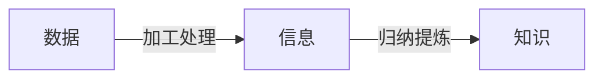
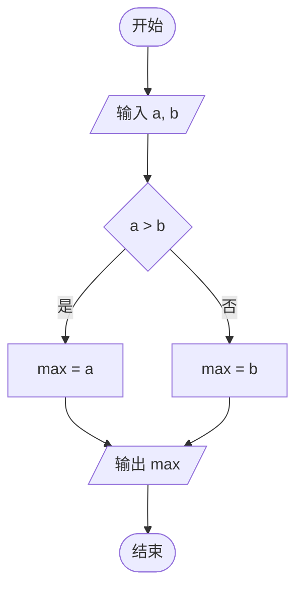

## 第一章 数据与信息

### 数据、信息与知识

#### 三者的概念

- **数据**（Data）：对客观事物的符号记录，如数字、文字、图像、声音、视频等，是信息的载体；
- **信息**（Information）：数据经过加工处理后，对人有意义、能消除不确定性的内容；
- **知识**（Knowledge）：对信息进行归纳、提炼、总结后得到的规律与经验。

三者的关系是逐层提炼：数据是原始素材，信息是被赋予了含义的数据，知识是从大量信息中总结出的规律。



同一份数据在不同场景下可解读出不同信息；脱离了上下文，数据本身没有意义。

#### 数据的特征

- **客观性**：数据是对事实的记录；
- **可存储与可传递**：数据能被记录、复制和传播；
- **多样性**：同一信息可用数值、文本、图像、声音等多种形式表示。

信息的特征则包括 **载体依附性**（信息须依附于数据载体）、**价值性**、**时效性**、**共享性**（信息可被多人同时使用而不损耗）与 **真伪性**。

### 数据的编码

#### 进制与数制

计算机内部一律用 **二进制**（Binary）表示数据，因为电子元件只有「通」「断」两种稳定状态，正好对应 `0` 和 `1`。

- **基数**：某进制中数码的个数。二进制基数为 $2$，八进制为 $8$，十进制为 $10$，十六进制为 $16$；
- **位权**：某一位上数码所代表数值的倍率，等于「基数的位序次幂」。

|   进制   | 基数 |       数码        | 常见后缀 |
| :------: | :--: | :---------------: | :------: |
|  二进制  | $2$  |       $0,1$       |    B     |
|  八进制  | $8$  |     $0\sim 7$     |    O     |
|  十进制  | $10$ |     $0\sim 9$     |    D     |
| 十六进制 | $16$ | $0\sim 9,A\sim F$ |    H     |

十六进制的 $A\sim F$ 依次代表十进制的 $10\sim 15$。

#### R 进制转十进制

**按权展开**：把每一位的数码乘以对应位权，再求和。整数部分从右往左位权为 $R^0,R^1,R^2,\dots$。

例如二进制 $(1101)_2$：

$$(1101)_2=1\times 2^3+1\times 2^2+0\times 2^1+1\times 2^0=13$$

十六进制 $(2F)_{16}=2\times 16^1+15\times 16^0=47$。

#### 十进制转 R 进制

**除 R 取余，逆序排列**：用十进制数不断除以 $R$，记录余数，直到商为 $0$，再把余数从下往上（末次到首次）写出。

把 $13$ 转为二进制：

| 步骤 |    算式    | 商  | 余数 |
| :--: | :--------: | :-: | :--: |
| $1$  | $13\div 2$ | $6$ | $1$  |
| $2$  | $6\div 2$  | $3$ | $0$  |
| $3$  | $3\div 2$  | $1$ | $1$  |
| $4$  | $1\div 2$  | $0$ | $1$  |

余数逆序读出为 $1101$，即 $13=(1101)_2$。

#### 二进制与八 / 十六进制互转

二进制转八进制：从小数点向两边每 **3 位** 分一组，不足补 $0$，每组转为一位八进制数。转十六进制则每 **4 位** 一组。

$$(10111100)_2=(1011\ 1100)_2=(BC)_{16}$$

反向转换时，把每一位八 / 十六进制数展开为 3 / 4 位二进制即可。之所以能这样直接分组，是因为 $8=2^3$、$16=2^4$。

#### 数据存储单位

- **位**（bit）：二进制的一位，取 `0` 或 `1`，是最小的存储单位；
- **字节**（Byte，B）：$8$ 个二进制位，即 8bit，是最基本的存储单位。

存储单位之间以 $2^{10}=1024$ 为进率：

| 单位 |  名称  |  换算  |
| :--: | :----: | :----: |
|  1B  |  字节  |  8bit  |
| 1KB  | 千字节 | 1024B  |
| 1MB  | 兆字节 | 1024KB |
| 1GB  | 吉字节 | 1024MB |
| 1TB  | 太字节 | 1024GB |

一个英文字符占 1B，一个汉字（GB2312 / GBK 编码）通常占 2B。

### 字符与数值的编码

#### ASCII 码

**ASCII**（American Standard Code for Information Interchange，美国信息交换标准代码）用 **7 位** 二进制编码，共可表示 $2^7=128$ 个字符，包括大小写字母、数字、标点和控制字符。实际存储时占 1B，最高位补 $0$。

必记的几个码值：

|      字符       | 十进制 ASCII 码 |
| :-------------: | :-------------: |
| `NUL`（空字符） |       $0$       |
|      空格       |      $32$       |
|       `0`       |      $48$       |
|       `A`       |      $65$       |
|       `a`       |      $97$       |

由此可推：`9` 的码值为 $48+9=57$；`Z` 为 $65+25=90$；小写字母比对应大写字母大 $32$。

#### 汉字编码

- **国标码**（GB2312）：为汉字规定的交换码；
- **机内码**：汉字在机器内部存储的编码，由国标码两个字节的最高位各置 $1$ 得到，以便与 ASCII 区分；
- **输入码**：从键盘录入汉字的编码，如拼音码、五笔码；
- **字形码**：描述汉字点阵或轮廓的编码，用于显示和打印。

一个 $16\times 16$ 点阵的汉字，需要 $16\times 16=256$ 位，即 $256\div 8=32$ 字节存储。

#### Unicode

**Unicode**（统一码）为世界上几乎所有字符分配了唯一编号，解决了不同编码互不兼容的问题。常见的实现方式是 **UTF-8**，它是一种变长编码：一个英文字符占 1B，一个汉字通常占 3B。

### 声音与图像的数字化

#### 声音的数字化

声音是连续的模拟信号，数字化要经过 **采样、量化、编码** 三步。

- **采样**：每隔一段时间测量一次声音的幅值，每秒采样次数称 **采样频率**（如 44.1kHz）；
- **量化**：把幅值划分为有限个等级，等级数由 **量化位数**（采样深度）决定；
- **编码**：把量化结果用二进制表示并存储。

采样频率越高、量化位数越大，音质越好，数据量也越大。未压缩声音文件的存储量估算：

$$\text{存储量}=\text{采样频率}\times\text{量化位数}\times\text{声道数}\times\text{时间}\div 8$$

结果单位为字节。常见音频格式有 WAV（无损）、MP3（有损压缩）。

#### 图像的数字化

位图（点阵图）由 **像素**（Pixel）排列而成，每个像素记录一种颜色。

- **分辨率**：图像的像素总数，如 $1024\times 768$；
- **颜色深度**：每个像素用多少位二进制表示颜色，$n$ 位可表示 $2^n$ 种颜色。

真彩色用 24 位（RGB 三通道各 8bit），可表示 $2^{24}$ 种颜色。位图存储量估算：

$$\text{存储量}=\text{水平像素}\times\text{垂直像素}\times\text{颜色深度}\div 8$$

- **位图**：放大后会失真（马赛克），适合表现色彩丰富的照片，格式如 BMP、JPG、PNG、GIF；
- **矢量图**：用数学公式描述图形，放大不失真，适合线条图形，格式如 SVG。

## 第二章 数据处理与应用

### 数据的采集与整理

#### 数据采集

获取数据的常见方式：

- **手工录入**：人工键入，适合小规模数据；
- **传感器采集**：温度、光照等物理量的自动采集；
- **网络爬取**：用程序从网页批量抓取；
- **数据库导出 / 开放数据集**：从已有系统或公开平台获取。

采集时要关注数据的 **准确性、完整性与合法性**，不得侵犯个人隐私。

#### 数据整理

采集到的原始数据往往含有缺失、重复、错误等问题，需要 **数据清洗**：

- 处理缺失值（补全或删除）；
- 去除重复记录；
- 纠正明显错误与格式不统一的数据。

整理后的数据常以 **二维表** 形式组织：每一行是一条记录，每一列是一个字段。

### 数据分析与可视化

#### 数据分析方法

- **统计分析**：求和、平均、最大 / 最小、计数等汇总；
- **对比分析**：比较不同类别或时间段的数据；
- **关联分析**：发现数据项之间的联系（如「购物篮」中商品的搭配）。

常用工具有电子表格（Excel、WPS）和编程语言（Python 的 `pandas` 库）。

#### 数据可视化

用图表把数据的规律直观呈现，选图要匹配数据特点：

| 图表类型 |         适用场景         |
| :------: | :----------------------: |
|  柱形图  |    比较不同类别的数量    |
|  折线图  | 表现数据随时间的变化趋势 |
|   饼图   |  表示各部分占整体的比例  |
|  散点图  |  观察两个变量之间的关系  |

好的可视化让人一眼看出趋势与异常，胜过一堆数字。

### 大数据

#### 大数据的特征

**大数据**（Big Data）指规模巨大、常规软件难以处理的数据集合，通常用 **4V** 概括其特征：

| 特征 |   英文   |           含义           |
| :--: | :------: | :----------------------: |
| 大量 |  Volume  |       数据规模巨大       |
| 高速 | Velocity |     产生和处理速度快     |
| 多样 | Variety  | 类型多样，含非结构化数据 |
| 价值 |  Value   |  价值密度低，但总价值高  |

价值密度低指有用信息在海量数据中占比很小，需要通过挖掘才能提取。

#### 大数据的应用

- **精准推荐**：电商、视频平台根据行为推荐内容；
- **智慧交通**：分析路况优化信号灯与导航；
- **疫情防控 / 舆情分析**：追踪传播、了解公众态度。

大数据在带来便利的同时，也伴随 **隐私泄露** 与 **数据安全** 风险，使用时须遵守法律与伦理。

## 第三章 算法与程序实现

### 算法的概念与描述

#### 算法的特征

**算法**（Algorithm）是解决问题的方法与步骤，须满足五个特征：

- **有穷性**：执行有限步后能结束；
- **确定性**：每一步含义明确，无歧义；
- **可行性**：每一步都能有效执行；
- **有零个或多个输入**；
- **有一个或多个输出**。

#### 算法的描述方式

同一个算法可用不同方式描述：

- **自然语言**：用日常语言叙述，通俗但易有歧义；
- **流程图**：用规定图形符号描述，直观清晰；
- **伪代码**：介于自然语言和程序语言之间，接近代码又不拘泥语法。

流程图的常用符号：

|    符号    |     名称      |         作用         |
| :--------: | :-----------: | :------------------: |
|  圆角矩形  |    起止框     | 表示算法的开始或结束 |
| 平行四边形 | 输入 / 输出框 | 表示数据的输入或输出 |
|    矩形    |    处理框     |    表示计算或赋值    |
|    菱形    |    判断框     | 表示条件判断，有分支 |
|    箭头    |    流程线     |    表示执行的方向    |

求两个数中较大者的流程：



### Python 基础

#### 变量与数据类型

**变量** 用来存放数据，无需事先声明，直接赋值即创建。Python 常见数据类型：

|  类型  | 关键字  |       示例       |
| :----: | :-----: | :--------------: |
|  整数  |  `int`  |       `10`       |
| 浮点数 | `float` |      `3.14`      |
| 字符串 |  `str`  |    `'hello'`     |
| 布尔值 | `bool`  | `True` / `False` |
|  列表  | `list`  |   `[1, 2, 3]`    |

用 `type(x)` 可查看变量 `x` 的类型；同一变量可先后存放不同类型的数据。

#### 运算符

- **算术运算符**：`+`、`-`、`*`、`/`（结果为浮点数）、`//`（整除）、`%`（取余）、`**`（乘方）；
- **关系运算符**：`>`、`<`、`>=`、`<=`、`==`、`!=`，结果为布尔值；
- **逻辑运算符**：`and`、`or`、`not`。

需要区分 `/` 与 `//`：`7 / 2` 得 `3.5`，`7 // 2` 得 `3`，`7 % 2` 得 `1`。

#### 输入与输出

`input()` 读取一行输入，**返回值始终是字符串**，做数值运算前要用 `int()` 或 `float()` 转换；`print()` 输出内容。

```python
name = input('请输入姓名：')
age = int(input('请输入年龄：'))
print(name, '明年', age + 1, '岁')
```

`print()` 默认以空格分隔多个参数、以换行结尾。

### 三种基本控制结构

任何算法都可由 **顺序、分支、循环** 三种结构组合而成。

#### 顺序结构

语句按书写先后逐条执行，是最基本的结构。

```python
a = 3
b = 4
c = (a ** 2 + b ** 2) ** 0.5
print(c)
```

#### 分支结构

根据条件是否成立选择执行路径，用 `if` / `elif` / `else`。

```python
score = int(input())
if score >= 90:
    print('优秀')
elif score >= 60:
    print('及格')
else:
    print('不及格')
```

Python 用 **缩进** 划分代码块，同一层语句缩进必须一致，通常为 4 个空格。

#### 循环结构

重复执行某段代码。`for` 用于已知次数的循环，`while` 用于按条件反复。

```python
s = 0
for i in range(1, 101):
    s = s + i
print(s)
```

`range(1, 101)` 生成 $1\sim 100$ 的整数，因此上例求的是 $1+2+\dots+100=5050$。

```python
n = int(input())
while n > 1:
    print(n)
    n = n // 2
```

`while` 循环要保证条件最终变为假，否则会 **死循环**。可用 `break` 提前跳出循环，`continue` 跳过本次剩余语句进入下一轮。

### 常见算法

#### 枚举算法

**枚举**（穷举）逐一尝试所有可能的解，判断是否满足条件。思路简单，适合规模不大的问题。

找出 $100$ 以内所有能同时被 $3$ 和 $5$ 整除的数：

```python
for n in range(1, 101):
    if n % 3 == 0 and n % 5 == 0:
        print(n)
```

#### 解析算法

**解析算法** 根据问题中已知量与未知量的关系，直接用公式求解，一步到位。

已知圆半径求面积：

```python
import math
r = float(input())
area = math.pi * r ** 2
print(area)
```

#### 排序与查找

**排序** 是把数据按大小重新排列。以 **冒泡排序** 为例，每一轮比较相邻两数，把较大的交换到后面：

```python
a = [5, 2, 8, 1, 9]
n = len(a)
for i in range(n - 1):
    for j in range(n - 1 - i):
        if a[j] > a[j + 1]:
            a[j], a[j + 1] = a[j + 1], a[j]
print(a)
```

**查找** 是在数据中找出目标。

- **顺序查找**：从头逐个比较，适用于任意数据；
- **二分查找**（对分查找）：仅适用于 **有序** 数据，每次比较中间元素，把查找范围缩小一半，效率更高。

```python
a = [1, 3, 5, 7, 9, 11]
x = int(input())
low, high = 0, len(a) - 1
found = False
while low <= high:
    mid = (low + high) // 2
    if a[mid] == x:
        found = True
        break
    elif a[mid] < x:
        low = mid + 1
    else:
        high = mid - 1
print(found)
```

二分查找每次排除一半数据，$n$ 个元素最多比较 $\log_2 n$ 次左右。

## 第四章 人工智能初步

### 机器智能

#### 人工智能的概念

**人工智能**（Artificial Intelligence，AI）研究如何让机器模拟人类的智能行为，如感知、推理、学习与决策。

实现智能的主要途径之一是 **机器学习**（Machine Learning）：让计算机从大量数据中自动总结规律，而非由人逐条编写规则。**深度学习**（Deep Learning）是机器学习的一个分支，用多层神经网络处理复杂数据，在图像、语音等领域效果突出。

#### 智能的判定

**图灵测试**（Turing Test）：若人类通过对话无法分辨对方是机器还是人，则认为该机器具有智能。它是判定机器智能的经典标准。

### 典型应用

#### 常见的智能应用

|     领域     |             应用举例             |
| :----------: | :------------------------------: |
|   图像识别   | 人脸识别、车牌识别、医学影像诊断 |
|   语音技术   |   语音输入、语音助手、机器翻译   |
| 自然语言处理 |   智能问答、文本分类、机器写作   |
|   自动控制   |   自动驾驶、工业机器人、无人机   |

#### 应用中的思考

人工智能提升了效率，也带来新的问题：算法可能存在 **偏见**，自动决策的 **责任归属** 不易界定，个人数据的采集使用涉及 **隐私** 与 **安全**。发展人工智能须兼顾技术进步与社会伦理，让技术真正服务于人。
