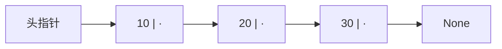
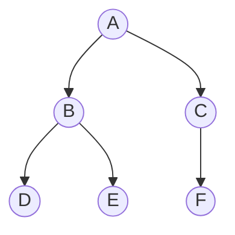

## 第一章 数据结构概述

### 数据与数据结构

- **数据**（Data）：能被计算机识别、存储和加工的对象，包括数值、文字、图像、声音等；
- **数据元素**（Data Element）：数据的基本单位，一个元素常由若干数据项组成；
- **数据结构**（Data Structure）：数据元素之间的关系，以及这些数据在计算机中的存储方式。

数据结构研究两件事：元素之间 **逻辑上** 怎样关联，元素在内存中 **物理上** 怎样存放。前者是逻辑结构，后者是存储结构。

### 逻辑结构

逻辑结构描述数据元素之间的关系，与计算机无关。按关系分为四类：

| 逻辑结构 |         元素关系         |      例子      |
| :------: | :----------------------: | :------------: |
| 集合结构 | 元素仅同属一个集合，无序 |  一堆无序数据  |
| 线性结构 |  一对一，元素排成一条链  | 数组、栈、队列 |
| 树形结构 |  一对多，存在层次与分支  | 文件目录、家谱 |
| 图形结构 |  多对多，元素间任意相连  | 地图、社交网络 |

集合结构可看作最松散的一类，一般归入其中三种讨论。**线性结构** 是本册的起点，树与图是它的推广。

### 存储结构

存储结构（又称物理结构）是逻辑结构在计算机中的实现，主要有两种：

- **顺序存储**：用一段 **连续** 的内存依次存放元素，元素的物理位置反映逻辑次序。优点是可按下标随机访问，缺点是插入删除要移动大量元素；
- **链式存储**：元素存放在 **不连续** 的内存中，每个元素额外保存指向下一个元素的地址（指针）。优点是插入删除只改指针，缺点是不能随机访问，且指针占用额外空间。

同一种逻辑结构可以有不同的存储结构。例如线性表既能用顺序存储（顺序表），也能用链式存储（链表）。

### 算法与复杂度

**算法**（Algorithm）是解决问题的一系列有限步骤。同一个问题往往有多种算法，衡量算法优劣主要看两点：

- **时间复杂度**：算法执行所需的时间，随数据规模增长的趋势；
- **空间复杂度**：算法执行所需的额外存储空间，随数据规模增长的趋势。

设问题规模为 $n$，用 **大 $O$ 记号** 描述复杂度的增长量级，只保留最高阶项、略去常数。例如循环执行 $3n+5$ 次，记为 $O(n)$。

常见复杂度由低到高排列：

$$O(1)<O(\log n)<O(n)<O(n\log n)<O(n^2)<O(2^n)<O(n!)$$

- $O(1)$：常数时间，与规模无关，如访问数组某一元素；
- $O(\log n)$：每步把规模折半，如二分查找；
- $O(n)$：线性，如遍历一遍数组；
- $O(n\log n)$：如快速排序、归并排序；
- $O(n^2)$：双重循环，如冒泡排序。

大 $O$ 记号刻画的是 **最坏情况** 下的增长趋势。$n$ 较小时常数的影响不可忽略，$n$ 较大时量级才起决定作用。

## 第二章 线性表

### 线性表的概念

**线性表**（Linear List）是 $n$ 个数据元素的有限序列，记为 $(a_1,a_2,\dots,a_n)$。表中元素个数 $n$ 称为 **表长**，$n=0$ 时称为 **空表**。

线性表的特点：

- 存在唯一的 **首元素** 和 **尾元素**；
- 除首元素外，每个元素有唯一的 **前驱**；
- 除尾元素外，每个元素有唯一的 **后继**。

线性表按存储方式分为 **顺序表** 与 **链表**。

### 顺序表

**顺序表** 用一段连续内存依次存放元素，逻辑上相邻的元素物理上也相邻。Python 的列表（`list`）本质上就是顺序表。

设第一个元素地址为 $b$，每个元素占 $c$ 个存储单元，则第 $i$ 个元素的地址为 $b+(i-1)c$。由此可直接算出任一元素的位置，**按下标访问是 $O(1)$**。

Python 中顺序表的基本操作：

```python
a = [10, 20, 30, 40]

x = a[2]          # 按下标访问，O(1)
a.append(50)      # 尾部插入，O(1)
a.insert(1, 15)   # 位置 1 插入，需后移元素，O(n)
a.pop(0)          # 删除首元素，需前移元素，O(n)
n = len(a)        # 表长，O(1)
```

顺序表的插入与删除要移动元素。在第 $i$ 个位置插入，需把其后 $n-i+1$ 个元素依次后移，平均移动约 $\frac{n}{2}$ 个元素，故 **插入、删除是 $O(n)$**。

### 链表

**链表**（Linked List）用链式存储实现线性表。每个元素封装成一个 **结点**（Node），结点包含两部分：

- **数据域**：存放元素本身；
- **指针域**：存放后继结点的地址。

只保存后继的链表称为 **单链表**。用一个 **头指针** 指向首结点，尾结点的指针域指向空（`None`）。



用 Python 实现单链表的结点与基本操作：

```python
class Node:
    def __init__(self, val):
        self.val = val      # 数据域
        self.next = None    # 指针域


class LinkedList:
    def __init__(self):
        self.head = None

    def append(self, val):          # 尾部插入，O(n)
        node = Node(val)
        if self.head is None:
            self.head = node
            return
        p = self.head
        while p.next is not None:
            p = p.next
        p.next = node

    def insert_after(self, p, val):  # 在结点 p 后插入，O(1)
        node = Node(val)
        node.next = p.next
        p.next = node

    def remove_after(self, p):       # 删除结点 p 的后继，O(1)
        if p.next is not None:
            p.next = p.next.next

    def find(self, val):             # 按值查找，O(n)
        p = self.head
        while p is not None:
            if p.val == val:
                return p
            p = p.next
        return None
```

链表插入删除只改指针，**不移动元素**，在已知位置处为 $O(1)$。但链表不能按下标直接定位，**访问第 $i$ 个元素要从头遍历**，为 $O(n)$。

### 顺序表与链表对比

|       操作       |      顺序表      |       链表       |
| :--------------: | :--------------: | :--------------: |
|    按下标访问    |      $O(1)$      |      $O(n)$      |
|     按值查找     |      $O(n)$      |      $O(n)$      |
| 已知位置插入删除 | $O(n)$（要移动） | $O(1)$（改指针） |
|     存储空间     |       紧凑       |    多存指针域    |
|     随机访问     |       支持       |      不支持      |

**结论**：读多写少、常按下标访问，用顺序表；频繁在中间插入删除，用链表。

## 第三章 栈与队列

栈与队列都是 **操作受限的线性表**，区别在于允许插入删除的位置不同。

### 栈

**栈**（Stack）只允许在一端进行插入和删除，该端称为 **栈顶**（Top），另一端称为 **栈底**。插入称为 **入栈**（Push），删除称为 **出栈**（Pop）。

栈的特点是 **后进先出**（Last In First Out，LIFO）：最后入栈的元素最先出栈。

Python 用列表模拟栈，尾部作为栈顶：

```python
stack = []

stack.append(1)     # 入栈
stack.append(2)
top = stack[-1]     # 取栈顶，不弹出
x = stack.pop()     # 出栈，返回 2
empty = len(stack) == 0
```

入栈、出栈、取栈顶均为 $O(1)$。

### 队列

**队列**（Queue）只允许在一端插入、另一端删除。插入的一端称为 **队尾**（Rear），删除的一端称为 **队首**（Front）。插入称为 **入队**（Enqueue），删除称为 **出队**（Dequeue）。

队列的特点是 **先进先出**（First In First Out，FIFO）：最先入队的元素最先出队。

用列表模拟队列时，`pop(0)` 出队要前移全部元素，为 $O(n)$。Python 标准库 `collections.deque`（双端队列）两端操作都是 $O(1)$：

```python
from collections import deque

q = deque()
q.append(1)         # 入队，O(1)
q.append(2)
front = q[0]        # 取队首
x = q.popleft()     # 出队，返回 1，O(1)
```

### 括号匹配

栈的典型应用之一是 **括号匹配**。遇到左括号入栈，遇到右括号与栈顶配对：栈顶是对应的左括号就出栈，否则不匹配。全部处理完栈为空则匹配成功。

```python
def match(s):
    pairs = {')': '(', ']': '[', '}': '{'}
    stack = []
    for ch in s:
        if ch in '([{':
            stack.append(ch)
        elif ch in ')]}':
            if not stack or stack.pop() != pairs[ch]:
                return False
    return len(stack) == 0
```

每个字符入栈出栈至多一次，时间复杂度 $O(n)$。

### 表达式求值

栈也用于 **表达式求值**。中缀表达式（如 `3+4*2`）人易读，机器难处理，通常先转成 **后缀表达式**（逆波兰式，如 `3 4 2 * +`），再用栈求值：

- 遇到操作数就入栈；
- 遇到运算符就弹出栈顶两个操作数，运算后把结果压回栈；
- 处理完栈中唯一元素即为结果。

后缀表达式求值无需括号，全程只用一个栈，时间复杂度 $O(n)$。

## 第四章 树

### 树的概念

**树**（Tree）是 $n$ 个结点的有限集合，是一种 **一对多** 的层次结构。$n=0$ 时为空树，否则有唯一的 **根结点**（Root），其余结点分成若干互不相交的子树。

常用术语：

- **结点的度**：一个结点拥有的子树个数；
- **叶结点**：度为 $0$ 的结点；
- **孩子** 与 **双亲**：结点的子树的根是它的孩子，它是孩子的双亲；
- **层次**：根为第 $1$ 层，孩子的层次比双亲多 $1$；
- **树的深度**（高度）：结点的最大层次。

### 二叉树

**二叉树**（Binary Tree）是每个结点 **至多有两棵子树** 的树，且子树有左右之分，分别称为 **左子树** 和 **右子树**。



二叉树的重要性质：

- 第 $i$ 层至多有 $2^{i-1}$ 个结点；
- 深度为 $k$ 的二叉树至多有 $2^k-1$ 个结点；
- 若叶结点数为 $n_0$、度为 $2$ 的结点数为 $n_2$，则 $n_0=n_2+1$。

**满二叉树**：每层结点都达到最大数。**完全二叉树**：只有最下层可以不满，且下层结点都靠左排列。完全二叉树可用顺序存储：结点 $i$ 的左孩子为 $2i$、右孩子为 $2i+1$、双亲为 $\lfloor i/2\rfloor$。

Python 用结点类表示二叉树：

```python
class TreeNode:
    def __init__(self, val):
        self.val = val
        self.left = None
        self.right = None
```

### 二叉树的遍历

**遍历** 是按某种次序访问树中每个结点一次。以「访问根」相对于「访问左右子树」的先后，二叉树有三种深度优先遍历：

- **前序遍历**：根 → 左子树 → 右子树；
- **中序遍历**：左子树 → 根 → 右子树；
- **后序遍历**：左子树 → 右子树 → 根。

对上图的二叉树，三种遍历结果为：

| 遍历方式 |  访问次序   |
| :------: | :---------: |
| 前序遍历 | A B D E C F |
| 中序遍历 | D B E A C F |
| 后序遍历 | D B E F C A |

三种遍历都可用递归实现，改变输出语句的位置即可：

```python
def preorder(root):     # 前序
    if root is None:
        return
    print(root.val)
    preorder(root.left)
    preorder(root.right)


def inorder(root):      # 中序
    if root is None:
        return
    inorder(root.left)
    print(root.val)
    inorder(root.right)


def postorder(root):    # 后序
    if root is None:
        return
    postorder(root.left)
    postorder(root.right)
    print(root.val)
```

每个结点访问一次，遍历的时间复杂度为 $O(n)$。

### 二叉搜索树

**二叉搜索树**（Binary Search Tree，BST）是一棵二叉树，满足：对任一结点，**左子树所有值都小于它，右子树所有值都大于它**。

由此性质，BST 的中序遍历结果是 **递增有序** 的。查找一个值时，从根出发：比根小往左走，比根大往右走，相等即找到。

```python
def search(root, key):
    while root is not None:
        if key == root.val:
            return root
        root = root.left if key < root.val else root.right
    return None
```

每比较一次就排除一棵子树，查找路径长度不超过树的高度。若 BST 平衡，高度约为 $\log n$，查找、插入、删除都是 $O(\log n)$；若退化成一条链，高度为 $n$，退化到 $O(n)$。

## 第五章 图

### 图的概念

**图**（Graph）是一种 **多对多** 的结构，由 **顶点**（Vertex）集合和 **边**（Edge）集合组成，记为 $G=(V,E)$。

- **无向图**：边没有方向，$(u,v)$ 与 $(v,u)$ 是同一条边；
- **有向图**：边有方向，$\langle u,v\rangle$ 表示从 $u$ 指向 $v$ 的弧；
- **度**：无向图中与顶点相连的边数；有向图区分 **入度** 与 **出度**；
- **带权图**（网）：边上附带权值，如距离、费用。

### 图的存储

图常用两种方式存储：邻接矩阵与邻接表。设图有 $n$ 个顶点。

**邻接矩阵**：用 $n\times n$ 的二维数组 $A$ 表示，$A_{i,j}=1$ 表示顶点 $i$ 到 $j$ 有边，否则为 $0$（带权图存权值）。

```python
n = 4
A = [[0] * n for _ in range(n)]
A[0][1] = A[1][0] = 1   # 无向图，对称
A[0][2] = A[2][0] = 1
```

**邻接表**：为每个顶点建一个列表，存放它的所有邻接点。

```python
g = [[] for _ in range(n)]
g[0].append(1)          # 顶点 0 与 1 相邻
g[1].append(0)
```

两者对比：

|   方式   |   空间   | 判断两点是否相邻 |    遍历某点的邻居    |
| :------: | :------: | :--------------: | :------------------: |
| 邻接矩阵 | $O(n^2)$ |      $O(1)$      |        $O(n)$        |
|  邻接表  | $O(n+m)$ |      $O(n)$      | $O(\text{该点度数})$ |

其中 $m$ 为边数。**稠密图用邻接矩阵，稀疏图用邻接表**。

### 图的遍历

从某顶点出发，按某种次序访问图中每个顶点一次，称为 **图的遍历**。有两种基本策略。

**深度优先遍历**（Depth First Search，DFS）：从一个顶点出发，沿一条路径尽量往深走，走不通再回退。用递归（或栈）实现，需要一个数组记录顶点是否已访问，避免重复。

```python
def dfs(u, g, visited):
    visited[u] = True
    print(u)
    for v in g[u]:
        if not visited[v]:
            dfs(v, g, visited)
```

**广度优先遍历**（Breadth First Search，BFS）：从一个顶点出发，先访问它的所有邻居，再访问邻居的邻居，一层层向外扩展。用 **队列** 实现。

```python
from collections import deque


def bfs(start, g, n):
    visited = [False] * n
    q = deque([start])
    visited[start] = True
    while q:
        u = q.popleft()
        print(u)
        for v in g[u]:
            if not visited[v]:
                visited[v] = True
                q.append(v)
```

用邻接表时，每个顶点和每条边各处理一次，DFS 与 BFS 的时间复杂度都是 $O(n+m)$。BFS 天然按层扩展，可求无权图的 **最短路径**。

## 第六章 查找

**查找** 是在数据集合中找出满足条件的元素。衡量查找算法用 **平均查找长度**，即找到目标平均需要比较的次数。

### 顺序查找

**顺序查找** 从头到尾逐个比较，找到即返回，遍历完仍未找到则失败。适用于任意存储的线性表，对数据是否有序无要求。

```python
def linear_search(a, key):
    for i in range(len(a)):
        if a[i] == key:
            return i
    return -1
```

查找 $n$ 个元素，最坏比较 $n$ 次，平均约 $\frac{n+1}{2}$ 次，时间复杂度 $O(n)$。

### 二分查找

**二分查找**（Binary Search）要求数据 **有序**。每次取中间元素与目标比较：相等即找到；目标较小则在左半部分继续；较大则在右半部分继续。每次比较把范围折半。

```python
def binary_search(a, key):
    lo, hi = 0, len(a) - 1
    while lo <= hi:
        mid = (lo + hi) // 2
        if a[mid] == key:
            return mid
        elif a[mid] < key:
            lo = mid + 1
        else:
            hi = mid - 1
    return -1
```

$n$ 个元素至多折半 $\log_2 n$ 次，时间复杂度 $O(\log n)$。代价是数据必须预先排好序。

| 查找方式 | 数据要求 | 时间复杂度  |
| :------: | :------: | :---------: |
| 顺序查找 |   任意   |   $O(n)$    |
| 二分查找 |   有序   | $O(\log n)$ |

## 第七章 排序

**排序** 是把一组数据按关键字重新排列成有序序列。除时间、空间外，排序还有一个重要指标——**稳定性**。

若排序后 **相等元素的相对次序保持不变**，则称该排序 **稳定**，否则 **不稳定**。

### 冒泡排序

**冒泡排序**（Bubble Sort）反复比较相邻两个元素，若次序相反就交换。每一趟把当前最大值「浮」到末尾，$n-1$ 趟后完成。

```python
def bubble_sort(a):
    n = len(a)
    for i in range(n - 1):
        for j in range(n - 1 - i):
            if a[j] > a[j + 1]:
                a[j], a[j + 1] = a[j + 1], a[j]
```

双重循环，时间复杂度 $O(n^2)$。相等元素不交换，故 **稳定**。

### 选择排序

**选择排序**（Selection Sort）每趟从未排序部分选出最小元素，放到已排序部分的末尾。

```python
def selection_sort(a):
    n = len(a)
    for i in range(n - 1):
        k = i
        for j in range(i + 1, n):
            if a[j] < a[k]:
                k = j
        a[i], a[k] = a[k], a[i]
```

无论数据如何，都要完整比较，时间复杂度恒为 $O(n^2)$。远距离交换可能改变相等元素次序，故 **不稳定**。

### 插入排序

**插入排序**（Insertion Sort）把待排元素逐个插入到前面已排好序的部分中，如同整理手中的扑克牌。

```python
def insertion_sort(a):
    for i in range(1, len(a)):
        key = a[i]
        j = i - 1
        while j >= 0 and a[j] > key:
            a[j + 1] = a[j]
            j -= 1
        a[j + 1] = key
```

最坏 $O(n^2)$，数据近乎有序时接近 $O(n)$。只在严格大于时后移，故 **稳定**。

### 快速排序

**快速排序**（Quick Sort）用 **分治** 思想：选一个 **基准**（Pivot），把小于它的元素放左边、大于它的放右边，再对左右两部分递归排序。

```python
def quick_sort(a):
    if len(a) <= 1:
        return a
    pivot = a[len(a) // 2]
    left = [x for x in a if x < pivot]
    mid = [x for x in a if x == pivot]
    right = [x for x in a if x > pivot]
    return quick_sort(left) + mid + quick_sort(right)
```

每趟划分是 $O(n)$，平均递归 $\log n$ 层，平均时间复杂度 $O(n\log n)$。基准选得差（如每次都取到最值）时退化为 $O(n^2)$。快速排序 **不稳定**。

### 排序算法对比

| 排序算法 | 平均时间复杂度 | 最坏时间复杂度 | 空间复杂度  | 稳定性 |
| :------: | :------------: | :------------: | :---------: | :----: |
| 冒泡排序 |    $O(n^2)$    |    $O(n^2)$    |   $O(1)$    |  稳定  |
| 选择排序 |    $O(n^2)$    |    $O(n^2)$    |   $O(1)$    | 不稳定 |
| 插入排序 |    $O(n^2)$    |    $O(n^2)$    |   $O(1)$    |  稳定  |
| 快速排序 |  $O(n\log n)$  |    $O(n^2)$    | $O(\log n)$ | 不稳定 |

**结论**：数据量小或近乎有序，用插入排序；一般大规模排序，快速排序平均最快。三种 $O(n^2)$ 算法中，冒泡与插入稳定，选择不稳定。
