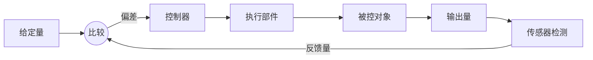
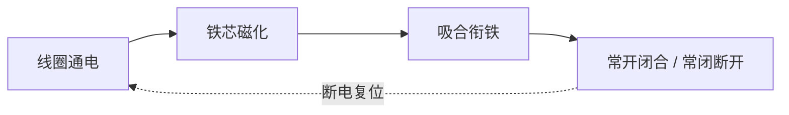

技术选考笔记，对应通用技术选修《电子控制技术》，按章整理。

## 电子控制概述

### 电子控制技术与电子控制系统

**电子控制技术**（Electronic Control Technology）指运用电子技术，对生产和生活中的对象进行自动控制的技术。它以电信号为工作媒介，把被控对象的状态转换成电信号，经处理后驱动执行部件动作。

- **电子控制系统**（Electronic Control System）：由电子元器件和电路组成、能完成特定控制功能的整体；
- 系统处理的是**电信号**，速度快、易于放大与传输，便于与计算机结合；
- 与机械控制、气动控制相比，电子控制精度高、响应快、易于实现自动化。

### 电子控制系统的组成和工作过程

电子控制系统一般由三部分组成，对应信号的输入、处理和输出。

|      组成      |            功能            |         典型器件         |
| :------------: | :------------------------: | :----------------------: |
| 信息的获取与转换 | 采集被控量，转换成电信号 |         各类传感器         |
|    信号处理    | 对信号放大、运算、判断决策 |  放大电路、逻辑电路、单片机  |
|    执行部分    | 把电信号转换成动作或其他能量 |   电动机、继电器、电磁铁   |

工作过程是信号在三部分之间依次传递的过程。

- 传感器把温度、光照、位置等**非电量**转换成电信号；
- 信号处理是系统的核心，决定「在什么条件下做什么」；
- 执行部件把处理结果变为实际动作，作用回被控对象。

### 开环电子控制系统和闭环电子控制系统

按有无反馈，电子控制系统分为开环和闭环两类。

- **开环控制**（Open-loop Control）：信号单向流动，输出不返回影响输入，系统不检测控制结果；
- **闭环控制**（Closed-loop Control）：把输出量检测后**反馈**到输入端，与给定量**比较**，用偏差修正控制，使输出趋近目标。

|          | 开环控制 | 闭环控制 |
| :------: | :------: | :------: |
|   反馈   |    无    |    有    |
|  抗干扰  |    弱    |    强    |
|   结构   |   简单   |   复杂   |
|   精度   |    低    |    高    |
| 典型例子 | 定时洗衣、普通路灯 | 恒温电熨斗、空调控温 |

闭环系统的关键在于**反馈**（Feedback）与**比较**：反馈环节检测输出并送回输入端，比较环节求出给定量与反馈量之差，即**偏差**。

- 开环系统按预定程序工作，一旦受干扰无法自行纠正；
- 闭环系统靠偏差调节，能自动补偿干扰，但可能因反馈不当产生振荡；
- 判断开环还是闭环，关键看**输出量是否被检测并送回输入端参与控制**。

## 电子控制系统信息的获取与转换

### 辨识常用传感器

**传感器**（Sensor）是把被测的物理量、化学量转换成便于处理的电信号的器件，是电子控制系统的「感官」。它一般由**敏感元件**和**转换元件**组成。

常用传感器按被测量分类如下。

|   类型   |     被测量     |          典型器件与特性          |
| :------: | :------------: | :------------------------------: |
| 光敏传感器 |    光照强度    |  光敏电阻，光照越强阻值越小  |
| 热敏传感器 |      温度      | 热敏电阻，分正温度系数和负温度系数 |
| 力敏传感器 |    力、压力    |     应变片、压力传感器     |
| 磁敏传感器 |      磁场      |     霍尔元件，输出与磁感应强度相关     |
| 气敏传感器 |    气体浓度    |      气敏电阻，检测烟雾、可燃气      |
| 湿敏传感器 |      湿度      |        湿敏电阻、湿敏电容        |

- **敏感元件**直接感受被测量，**转换元件**把它变成电信号；
- 衡量传感器的主要指标有**灵敏度**、**量程**、**精度**和**响应时间**；
- 热敏电阻中，负温度系数（NTC）随温度升高阻值减小，正温度系数（PTC）反之。

### 传感器的应用

传感器常与电阻串联组成**分压电路**，把阻值变化转换成电压变化，供后级处理。

- **光控**：光敏电阻与定值电阻串联，光照变化引起分压点电压变化，可做光控路灯、自动窗帘；
- **温控**：热敏电阻感温，配合比较电路控制加热或制冷，如恒温箱、电子体温计；
- **报警**：气敏、烟雾传感器检测到浓度超标时输出信号，触发声光报警。

以光敏电阻的分压为例，光照增强时其阻值 $R$ 减小，若与定值电阻 $R_0$ 串联接在电压 $U$ 上，光敏电阻两端电压为

$$
U_R=\frac{R}{R+R_0}U
$$

阻值 $R$ 随光照下降，分压 $U_R$ 随之下降，据此可判断光照的强弱。

## 电子控制系统的信号处理

### 模拟信号与数字信号

系统处理的信号分为两类。

- **模拟信号**（Analog Signal）：时间和幅值都**连续**的信号，如温度、声音对应的电压；
- **数字信号**（Digital Signal）：取值**离散**、通常只有高低两种电平的信号，用 0 和 1 表示。

|          |   模拟信号   |    数字信号    |
| :------: | :----------: | :------------: |
|   取值   |     连续     |      离散      |
| 抗干扰性 |      弱      |       强       |
|   处理   |   模拟电路   |    数字电路    |
|   例子   | 话筒输出电压 | 开关状态、脉冲 |

模拟量与数字量之间通过**模数转换**（A/D）和**数模转换**（D/A）互相转换。计算机内部处理的是数字信号，故传感器采集的模拟量常需先经 A/D 转换。

### 初识模拟电路

模拟电路处理连续信号，核心是对信号的**放大**。常用元器件如下。

|  元件  |   符号意义   |            主要特性            |
| :----: | :----------: | :----------------------------: |
| 电阻器 |  限流、分压  |    阻值 $R$，单位欧姆（Ω）     |
| 电容器 | 隔直、滤波、储能 |    容量 $C$，通交流阻直流    |
| 二极管 |  单向导电性  |   正向导通、反向截止   |
| 三极管 |  电流放大、开关  |     用小电流控制大电流     |

**二极管**（Diode）由 PN 结构成，具有**单向导电性**：正向偏置时导通，反向偏置时截止，常用于整流、检波和保护。

**三极管**（Transistor）有基极 b、集电极 c、发射极 e 三个电极，分 NPN 和 PNP 两种。在放大电路中，基极小电流 $I_b$ 控制集电极大电流 $I_c$，二者近似满足

$$
I_c=\beta I_b
$$

其中 $\beta$ 为电流放大系数。三极管有三种工作状态。

|  状态  |         条件         |     等效     |
| :----: | :------------------: | :----------: |
| 截止 | 发射结反偏或零偏 | 开关断开 |
| 放大 | 发射结正偏、集电结反偏 | 线性放大 |
| 饱和 | 发射结、集电结均正偏 | 开关闭合 |

- 做**放大**用时，让三极管工作在放大区；
- 做**开关**用时，让三极管在截止与饱和之间切换，这是数字电路的基础。

### 走进数字电路

数字电路处理数字信号，基本单元是**逻辑门**（Logic Gate）。三种基本逻辑门及其真值表如下。

**与门**（AND）：输入全为 1，输出才为 1，逻辑式 $Y=A\cdot B$。

| $A$ | $B$ | $Y$ |
| :-: | :-: | :-: |
|  0  |  0  |  0  |
|  0  |  1  |  0  |
|  1  |  0  |  0  |
|  1  |  1  |  1  |

**或门**（OR）：输入有一个为 1，输出即为 1，逻辑式 $Y=A+B$。

| $A$ | $B$ | $Y$ |
| :-: | :-: | :-: |
|  0  |  0  |  0  |
|  0  |  1  |  1  |
|  1  |  0  |  1  |
|  1  |  1  |  1  |

**非门**（NOT）：输出与输入相反，逻辑式 $Y=\bar{A}$。

| $A$ | $Y$ |
| :-: | :-: |
|  0  |  1  |
|  1  |  0  |

- 与、或、非是数字逻辑的基本运算，可组合出更复杂的功能；
- 逻辑「1」「0」对应电路的**高电平**和**低电平**；
- 三极管的截止对应输出高电平、饱和对应输出低电平，是实现逻辑门的物理基础。

### 数字电路的仿真实验与应用

设计数字电路时，先用**仿真软件**在计算机上搭建电路、验证逻辑，再制作实物，可减少反复与损耗。

- 仿真能直观显示各点电平和逻辑关系，便于查错；
- 组合多个逻辑门可实现判断、计数、译码等功能，如楼道声光控开关、简易报警器；
- 仿真通过后再焊接、调试，遵循「先仿真、后实物」的原则。

## 电子控制系统的执行部分

### 执行部件

**执行部件**（Actuator）位于系统末端，把电信号转换成机械动作或其他形式的能量，直接作用于被控对象。

|  执行部件  |    能量转换    |       应用       |
| :--------: | :------------: | :--------------: |
|   电动机   |  电能转机械能  |   驱动转动、行走   |
|   电磁铁   |  电能转磁力  |   吸放、牵引   |
| 发光二极管 |   电能转光能   |    指示、显示    |
|   扬声器   |   电能转声能   |    发声、提示    |
| 电加热器 | 电能转热能 | 加热、控温 |

执行部件往往需要较大的电流或电压，而信号处理电路输出的信号较弱，二者之间常用**继电器**衔接。

### 继电器的作用和类型

**继电器**（Relay）是用小电流控制大电流的自动开关，能在两个电路之间传递控制并实现**电气隔离**。

- **控制作用**：用弱电控制强电，用低压电路控制高压电路；
- **隔离作用**：控制电路与被控电路彼此独立，互不干扰、保障安全；
- **转换与放大**：把小信号转换为触点的通断，间接放大控制能力。

按工作原理，继电器分为电磁继电器、固态继电器、时间继电器等，其中**直流电磁继电器**最为常见。

### 直流电磁继电器的构造、规格和工作原理

直流电磁继电器由电磁系统和触点系统两部分构成。

- **电磁系统**：线圈、铁芯、衔铁、复位弹簧；
- **触点系统**：动触点与静触点，分**常开触点**（NO）、**常闭触点**（NC）和**公共端**（COM）。

工作原理：线圈通电后铁芯被磁化，产生磁力吸合衔铁，带动动触点动作——常开触点闭合、常闭触点断开；线圈断电后磁力消失，弹簧使衔铁复位，触点恢复原状。

主要**规格参数**如下。

|    参数    |             含义             |
| :--------: | :--------------------------: |
| 额定工作电压 |  线圈正常工作所需的电压  |
| 吸合电压 | 使衔铁可靠吸合的最小线圈电压 |
| 释放电压 | 使衔铁可靠释放的最大线圈电压 |
| 触点容量 | 触点能通过的最大电压和电流 |

- 选用继电器时，线圈参数要与控制电路匹配，触点容量要满足被控电路；
- 因线圈是感性元件，断电瞬间会产生反向电动势，常在线圈两端反并联一只**续流二极管**保护电路；
- 常开、常闭触点的区分是接线的关键：线圈未通电时断开的是常开，闭合的是常闭。

## 电子控制系统的设计及其应用

### 简单功能电路的安装与调试

把设计好的电路变为实物，一般按以下步骤进行。

- **识读电路图**：看懂元件符号、连接关系和参数；
- **清点元器件**：用万用表检测元件好坏，核对规格；
- **布局与焊接**：合理排布、连线短而清晰，焊点做到光亮、饱满、无虚焊；
- **检查电路**：对照电路图核查连线，防止短路、接错；
- **通电调试**：先测静态、再测功能，逐步排查故障。

**万用表**是安装调试的基本工具，可测电阻、电压、电流，判断通断和元件好坏；焊接时注意电烙铁温度和时间，避免烫伤元件或造成虚焊。

### 开环电子控制系统的设计和应用

开环系统结构简单，适用于对精度要求不高、干扰较小的场合。设计流程如下。

- 明确控制要求，画出系统方框图；
- 选择合适的传感器、信号处理方式和执行部件；
- 设计并连接电路，安装后通电调试。

例如**定时控制**：按预定时间接通或断开电路，如定时开关、简易抢答器的计时。系统按程序动作，不检测执行结果，故为开环。

### 闭环电子控制系统的设计和应用

当要求控制量稳定、抗干扰能力强时，采用闭环系统，在开环的基础上增加**反馈**环节。

- 检测输出量并反馈到输入端，与给定量比较得到偏差；
- 控制器根据偏差调节执行部件，使输出趋近目标；
- 反馈使系统能自动补偿干扰，但需防止调节过度引起振荡。

例如**光控路灯**：光敏传感器检测环境光照，天暗到设定值时自动亮灯、天亮时熄灭，光照的变化通过传感器反馈参与控制，构成闭环。又如**恒温控制**：温度传感器实时监测温度，低于设定值时加热、高于设定值时停止，使温度稳定在目标附近。
