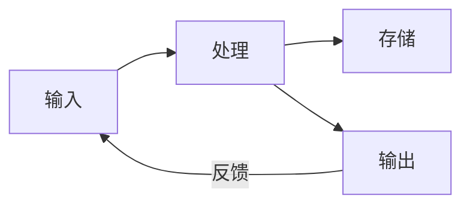

技术学考 / 选考笔记，对应信息技术必修《信息系统与社会》，按章整理。

## 第一章 信息系统的概念

### 数据、信息与知识

#### 三者的关系

- **数据**（Data）：对客观事物的性质、状态及相互关系进行记载的符号，如数字、文字、图像、声音等，是信息的载体；
- **信息**（Information）：数据经过加工处理、赋予含义后的结果，能减少认识上的不确定性；
- **知识**（Knowledge）：对信息进行归纳、演绎、总结后形成的规律与经验。

三者层层递进：数据是原料，信息是有意义的数据，知识是系统化的信息。

| 层次 |     含义     |        例子        |
| :--: | :----------: | :----------------: |
| 数据 | 未加工的符号 |    `38`、`小雨`    |
| 信息 | 有含义的数据 | 今天气温 38 摄氏度 |
| 知识 | 规律性的认识 |  高温天要防暑降温  |

#### 信息的特征

- **载体依附性**：信息必须依附于某种载体存在，同一信息可用不同载体表示；
- **价值性**：信息能满足人们某方面需求，可增值，也会随时间贬值；
- **时效性**：信息的价值有时间限制，过期则失效；
- **共享性**：信息可被多方同时占有，共享不会造成损耗；
- **真伪性**：信息有真有假，需要甄别。

### 系统与信息系统

#### 系统的概念

**系统**（System）：由相互联系、相互作用的若干要素组成的、具有特定功能的有机整体。系统有三个基本特征：

- **整体性**：各要素服从整体，整体功能大于各部分之和；
- **相关性**：要素之间相互依赖、相互制约；
- **目的性**：系统为实现某一目标而存在。

#### 信息系统的概念

**信息系统**（Information System，IS）：由计算机硬件、软件、数据、人员、网络等要素组成，能对信息进行采集、传输、存储、加工、维护和使用的人机系统。

信息系统的核心是「人机结合」：既包含技术要素，又离不开人的参与，最终服务于组织的管理与决策。

### 信息系统的组成

#### 五大要素

| 要素 |         作用         |            举例            |
| :--: | :------------------: | :------------------------: |
| 硬件 |  信息处理的物质基础  | 主机、终端、存储、网络设备 |
| 软件 |  控制硬件、处理数据  | 操作系统、数据库、应用软件 |
| 数据 |    系统加工的对象    |     文字、图像、音视频     |
| 人员 | 开发、管理与使用系统 |   开发人员、管理员、用户   |
| 网络 | 连接各部分、传输信息 |       局域网、互联网       |

其中 **人是信息系统中最活跃、最关键的要素**：硬件、软件、数据都由人设计、维护和使用。

#### 信息系统的功能

- **输入**：采集数据（键盘、扫描、传感器等）；
- **处理**：对数据进行计算、分类、检索、统计；
- **存储**：把数据保存到存储设备中；
- **输出**：将结果以文字、图表等形式呈现；
- **控制与反馈**：监控系统运行，根据结果调整。

一个完整的信息系统按「输入 → 处理 → 存储 → 输出」的流程运转，并通过反馈不断优化。

#### 信息系统的类型

|     类型     |          典型代表          |
| :----------: | :------------------------: |
| 事务处理系统 |   售票系统、银行柜台系统   |
| 管理信息系统 | 进销存、学籍管理、财务系统 |
| 决策支持系统 |   数据分析、辅助决策平台   |
| 地理信息系统 |   电子地图、导航（GIS）    |
|   专家系统   |     智能诊断、智能问答     |

### 信息社会的支撑技术

#### 现代信息技术

- **计算机技术**：信息处理的核心；
- **通信技术**：实现信息的远距离传输；
- **网络技术**：把分散的计算机连成整体；
- **传感技术**：采集现实世界的数据，是「机器的感官」；
- **人工智能**：让机器具备学习与推理能力。

以上技术相互融合，共同支撑现代信息系统的运转。

## 第二章 计算机与移动终端

### 计算机的工作原理

#### 冯·诺依曼结构

现代计算机大多采用 **冯·诺依曼结构**（von Neumann Architecture），两个核心思想是 **存储程序** 与 **程序控制**：把程序和数据一同存入存储器，计算机按顺序自动取出指令并执行。

其五大部件：

|   部件   |              功能              |
| :------: | :----------------------------: |
|  运算器  |     完成算术运算和逻辑运算     |
|  控制器  | 取指令、发出控制信号，指挥全局 |
|  存储器  |         存放程序和数据         |
| 输入设备 |        把信息送入计算机        |
| 输出设备 |        把结果输出给用户        |

运算器与控制器合称 **中央处理器**（Central Processing Unit，CPU），是计算机的核心。

#### 硬件与软件

- **硬件**：构成计算机的物理部件，是「躯体」；
- **软件**：运行在硬件上的程序与数据，是「灵魂」。

二者相互依存：没有软件的硬件是「裸机」，没有硬件的软件无从运行。

#### 数据的存储单位

计算机内部用 **二进制** 表示数据。最小单位是 **位**（bit），8 位为 1 **字节**（Byte）。常用换算按 $2^{10}=1024$ 进位：

$$1\text{B}=8\text{bit},\quad 1\text{KB}=1024\text{B},\quad 1\text{MB}=1024\text{KB},\quad 1\text{GB}=1024\text{MB}$$

一个西文字符占 1 字节，一个汉字（GB2312 / GBK 编码）通常占 2 字节。

### 操作系统

#### 概念与功能

**操作系统**（Operating System，OS）：管理计算机软硬件资源、为用户和应用程序提供服务的系统软件，是用户与硬件之间的桥梁。它的主要功能：

- **处理器管理**：合理分配 CPU，调度多个任务；
- **存储管理**：分配和回收内存；
- **文件管理**：组织、存取磁盘上的文件；
- **设备管理**：驱动并管理各类外设；
- **作业管理**：为用户提供操作界面。

#### 常见操作系统

|  平台  |        代表系统         |
| :----: | :---------------------: |
| 桌面端 |  Windows、macOS、Linux  |
| 移动端 | Android、iOS、HarmonyOS |
| 服务器 |  Linux、Windows Server  |

### 移动终端

#### 概念与特征

**移动终端**：可在移动中使用、具备计算与通信能力的智能设备，如智能手机、平板电脑、可穿戴设备。相比传统计算机，它具有 **便携性、随身性、位置感知** 等特点，通过无线网络随时接入信息系统。

#### 传感器

移动终端内置多种 **传感器**（Sensor），把物理量转化为电信号：

|   传感器    |       用途       |
| :---------: | :--------------: |
| GPS / 北斗  |     定位导航     |
|  加速度计   | 计步、横竖屏切换 |
|   陀螺仪    |  姿态与旋转检测  |
| 光线传感器  | 自动调节屏幕亮度 |
| 指纹 / 人脸 |     身份识别     |

传感器是信息系统连接物理世界的入口，也是物联网的技术基础。

## 第三章 网络与物联网

### 计算机网络

#### 概念

**计算机网络**：把地理位置分散、功能独立的多台计算机，用通信线路和网络设备连接起来，在网络协议的管理下实现 **资源共享** 与 **信息传递** 的系统。

组网的两大目标是 **资源共享**（硬件、软件、数据）与 **数据通信**。

#### 按覆盖范围分类

|  类型  | 英文简称 |       范围       |       例子       |
| :----: | :------: | :--------------: | :--------------: |
| 局域网 |   LAN    | 一栋楼、一个校园 | 机房、家庭 Wi-Fi |
| 城域网 |   MAN    |     一座城市     |   城市宽带骨干   |
| 广域网 |   WAN    |   跨地区、跨国   |      互联网      |

覆盖范围越大，传输速率通常越低、结构越复杂。

#### 网络拓扑结构

**拓扑结构**指网络中各节点的连接方式。常见的有星型、总线型、环型：

|  拓扑  |         特点         |            优缺点            |
| :----: | :------------------: | :--------------------------: |
|  星型  |  各节点连到中心节点  | 便于管理，中心故障则全网瘫痪 |
| 总线型 | 所有节点共享一条总线 |  结构简单，总线故障影响全网  |
|  环型  |   节点首尾相连成环   |  传输有序，单点断开影响整体  |

目前局域网多采用以 **交换机** 为中心的星型结构。

### 网络协议

#### 协议的概念

**网络协议**（Protocol）：通信双方为实现数据交换而共同遵守的规则，规定了数据的格式、传输方式与出错处理。协议是网络通信的「共同语言」。

#### OSI 参考模型与 TCP/IP 模型

**OSI 参考模型**（Open System Interconnection）把网络通信分为七层，是理论模型；实际应用广泛的是 **TCP/IP 模型**，通常简化为四层。分层的好处是各层独立、职责清晰、便于扩展。

|  OSI 七层  | TCP/IP 四层 |       主要功能       |   典型协议 / 设备    |
| :--------: | :---------: | :------------------: | :------------------: |
|   应用层   |   应用层    |  为应用程序提供服务  | HTTP、FTP、SMTP、DNS |
|   表示层   |   应用层    | 数据格式转换、加解密 |          ——          |
|   会话层   |   应用层    |    建立、管理会话    |          ——          |
|   传输层   |   传输层    |    端到端可靠传输    |       TCP、UDP       |
|   网络层   |   网络层    |    寻址与路由选择    |      IP、路由器      |
| 数据链路层 | 网络接口层  |  相邻节点间成帧传输  |     交换机、网卡     |
|   物理层   | 网络接口层  |    传输原始比特流    |  网线、光纤、集线器  |

#### TCP 与 UDP

传输层的两个核心协议：

|          |          TCP           |         UDP          |
| :------: | :--------------------: | :------------------: |
| 连接方式 | 面向连接（先建立连接） |  无连接（直接发送）  |
|  可靠性  |   可靠、有确认与重传   |   不可靠、可能丢包   |
|   速度   |        相对较慢        |          快          |
| 适用场景 |  网页、文件传输、邮件  | 视频直播、语音、游戏 |

**TCP**（Transmission Control Protocol）保证数据完整有序，**UDP**（User Datagram Protocol）追求速度、容忍少量丢失。**IP**（Internet Protocol）负责寻址和路由，是网络层的核心协议。

### IP 地址与域名

#### IP 地址

**IP 地址**：分配给网络中每台设备的唯一标识，用于定位主机。IPv4 地址由 32 位二进制组成，通常写成四段十进制（点分十进制），每段 $0\sim 255$：

$$192.168.1.1$$

由于 IPv4 地址即将耗尽，采用 128 位的 **IPv6** 是发展方向，可提供近乎无限的地址空间。

#### 域名与 DNS

**域名**（Domain Name）：为便于记忆而给主机取的字符名字，如 `www.lailai.one`。域名和 IP 地址一一对应，把域名解析为 IP 地址的服务叫 **DNS**（Domain Name System，域名系统）。

访问网站时，浏览器先向 DNS 服务器查询域名对应的 IP 地址，再据此建立连接。域名从右到左级别递减：`.one` 是顶级域名，`lailai` 是二级域名，`www` 是主机名。

### 网络设备

|    设备    |             作用             |
| :--------: | :--------------------------: |
|    网卡    |     计算机接入网络的接口     |
|   集线器   | 共享带宽，简单转发（已淘汰） |
|   交换机   |  按 MAC 地址在局域网内转发   |
|   路由器   | 连接不同网络，按 IP 选择路径 |
| 调制解调器 |  数字信号与模拟信号相互转换  |

**交换机** 工作在数据链路层，用于组建局域网；**路由器** 工作在网络层，负责网络之间的互联和寻址。

### 物联网

#### 概念

**物联网**（Internet of Things，IoT）：通过传感器、射频识别等技术，让物品与网络相连，实现物与物、物与人之间信息交换的网络。核心是把「物」接入互联网，让万物可感知、可识别、可控制。

#### 体系结构

物联网通常分为三层：

|  层次  |         功能         |         技术         |
| :----: | :------------------: | :------------------: |
| 感知层 |  采集物理世界的数据  | 传感器、RFID、二维码 |
| 网络层 |   传输感知层的数据   | 有线 / 无线网络、5G  |
| 应用层 | 对数据加工并提供服务 |  智能家居、智慧交通  |

**RFID**（Radio Frequency Identification，射频识别）是物联网的关键技术，如公交卡、门禁卡、电子标签，可非接触地读取信息。

#### 应用

- **智能家居**：远程控制照明、家电；
- **智慧交通**：ETC、共享单车、实时路况；
- **智慧农业**：监测温湿度、自动灌溉；
- **可穿戴设备**：健康监测、运动记录。

## 第四章 信息系统中的数据

### 数据管理的发展

数据管理经历了三个阶段：

|      阶段      |               特点               |
| :------------: | :------------------------------: |
|  人工管理阶段  |       数据不保存、无法共享       |
|  文件系统阶段  | 数据以文件保存，冗余大、独立性差 |
| 数据库系统阶段 |    统一管理，冗余小、共享性高    |

**数据库系统** 是当前主流，能有效解决数据冗余和不一致的问题。

### 数据库基础

#### 基本概念

- **数据库**（Database，DB）：按一定结构组织、长期存储的数据集合；
- **数据库管理系统**（Database Management System，DBMS）：管理数据库的系统软件，负责数据的建立、增删改查与安全，如 MySQL、SQLite、Access；
- **数据库系统**（DBS）：由数据库、DBMS、应用程序和用户共同组成的整体。

#### 关系数据库

目前应用最广的是 **关系数据库**，用二维表存储数据。相关术语：

|    术语    |           含义           |
| :--------: | :----------------------: |
|     表     |   存储同类数据的二维表   |
| 记录（行） | 表中的一行，一个完整对象 |
| 字段（列） |   表中的一列，一个属性   |
|    主键    |  唯一标识一条记录的字段  |

**主键**（Primary Key）不能重复、不能为空，用于唯一区分每条记录，如学号、身份证号。

#### 数据的基本操作

对数据库的常见操作可概括为增（插入）、删（删除）、改（修改）、查（查询），其中 **查询** 最常用。查询往往伴随 **筛选**（按条件选出记录）与 **排序**（按某字段升降序排列）。

### 数据的采集与安全

#### 数据采集

采集数据是信息系统的起点，常见方式：

- **手工录入**：键盘输入表单；
- **自动采集**：传感器、扫码、摄像头；
- **网络获取**：接口调用、网络爬取。

采集要保证数据的 **准确性、完整性、及时性**，为后续处理打好基础。

#### 数据备份

**备份**（Backup）：把数据复制一份另存，以防丢失。数据一旦损坏或误删，可用备份 **恢复**。重要数据应定期、异地备份，做到「不把鸡蛋放在一个篮子里」。

## 第五章 信息安全

### 信息系统的安全威胁

信息系统面临的威胁来自多方面：

|    威胁    |             表现             |
| :--------: | :--------------------------: |
| 计算机病毒 | 自我复制、破坏数据、传播蔓延 |
|    木马    | 潜伏后台，窃取信息、远程控制 |
|  黑客攻击  |   非法入侵、篡改或窃取数据   |
| 自然与人为 | 断电、火灾、误操作、硬件损坏 |

**计算机病毒**具有 **传染性、潜伏性、破坏性、隐蔽性、可触发性**，是最典型的安全威胁。病毒本质是一段人为编制的程序代码，并非「生物病毒」。

### 加密与认证

#### 数据加密

**加密**（Encryption）：把原始数据（明文）通过算法变换为不可直接读懂的密文，只有掌握 **密钥** 的人才能解密还原。加密是保护数据机密性的核心手段。

- **对称加密**：加密和解密用同一密钥，速度快，密钥保管是难点；
- **非对称加密**：用公钥加密、私钥解密，密钥分发安全，速度较慢。

#### 身份认证

**身份认证**：确认操作者身份是否合法。常见方式：

- **口令**：用户名 + 密码，最基础但易泄露；
- **生物识别**：指纹、人脸、虹膜，难以伪造；
- **数字证书 / 数字签名**：验证身份并防止数据被篡改。

**数字签名**能同时保证信息的 **完整性**（未被篡改）和 **不可否认性**（发送者无法抵赖）。

### 防火墙与防护

#### 防火墙

**防火墙**（Firewall）：位于内部网络与外部网络之间的安全屏障，按预设规则允许或阻止数据通过，控制内外网的访问，抵御外部入侵。它是网络安全的第一道防线。

#### 日常防护措施

- 安装 **杀毒软件** 并及时更新病毒库；
- 及时给系统和软件 **打补丁**，修补漏洞；
- 设置强口令并定期更换，不同平台不用同一密码；
- 不打开来路不明的邮件、链接和文件；
- 重要数据定期备份。

安全防护是「三分技术、七分管理」：再好的技术，也要靠人的安全意识来落实。

### 法律法规与社会责任

#### 相关法律法规

我国已建立较完整的信息安全法律体系，如《中华人民共和国网络安全法》《中华人民共和国数据安全法》《中华人民共和国个人信息保护法》，明确了网络运营者的责任与公民的权利。侵入他人系统、传播病毒、窃取和非法买卖个人信息等都属违法行为。

#### 信息社会责任

- 尊重 **知识产权**，不盗版、不剽窃；
- 保护 **个人隐私**，不非法收集、泄露他人信息；
- 遵守网络道德，不造谣、不传谣、不网络暴力；
- 合理使用信息技术，不沉迷、不滥用。

## 第六章 信息技术与社会

### 信息社会的特征

**信息社会**（Information Society）：以信息技术为基础，信息成为重要资源和生产力的社会形态。相较于工业社会，它具有以下特征：

- **信息经济化**：信息产业成为支柱产业；
- **社会网络化**：人们的生产生活高度依赖网络；
- **决策科学化**：依靠数据分析辅助决策；
- **生活数字化**：购物、支付、办公、学习都可在线完成。

### 信息技术的影响

#### 积极影响

- 提高生产效率，催生新业态（电商、直播、远程办公）；
- 打破时空限制，方便交流与获取信息；
- 促进教育、医疗等公共服务的普及。

#### 消极影响

- **信息泛滥**：虚假、冗余信息充斥，甄别困难；
- **网络成瘾**：过度依赖影响身心健康；
- **隐私泄露**：个人信息易被收集和滥用；
- **网络犯罪**：诈骗、病毒、黑客攻击增多。

面对信息技术，应 **趋利避害、理性使用**，做信息社会负责任的参与者。

### 数字鸿沟

**数字鸿沟**（Digital Divide）：不同地区、群体之间因掌握和运用信息技术的差异，而在信息获取和利用上形成的差距。它可能加剧社会不平等：能上网、会用信息技术的人获得更多机会，反之则被边缘化。

缩小数字鸿沟的途径：普及网络基础设施、推广信息技术教育、降低设备与上网成本。

### 信息伦理与规范

#### 信息伦理

**信息伦理**：人们在信息活动中应遵守的道德准则。核心是尊重、诚信、责任——尊重他人的知识产权和隐私，如实发布信息，为自己的言行负责。

#### 网络行为规范

- 文明上网，理性表达，不传播不良信息；
- 遵守网络实名制等管理规定；
- 保护自己和他人的账号与隐私；
- 不参与、不协助网络违法活动。

技术是中性的，方向取决于使用它的人。信息素养不仅是会用技术，更包括对信息的判断力和对社会的责任感。
