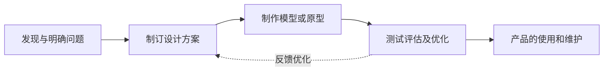
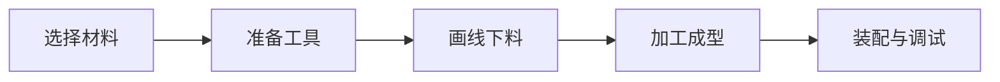

技术学考 / 选考笔记，对应通用技术必修《技术与设计 1》，按章整理。

## 走进技术世界

### 技术的价值

技术源于人类的需要和愿望，其根本目的是解决问题、满足需要。技术的价值集中体现在它与人、与社会、与自然的关系上。

#### 技术与人

技术保护人、解放人、发展人，三者层层递进。

|  作用  |                含义                |             例子             |
| :----: | :--------------------------------: | :--------------------------: |
| 保护人 |  弥补人体机能的不足，抵御外部伤害  | 衣服御寒、头盔护脑、疫苗防病 |
| 解放人 | 扩展人的能力，把人从繁重劳动中释放 |  机器代替体力、交通代替步行  |
| 发展人 |    提升人的智力、体力和精神境界    | 显微镜拓展视野、乐器丰富生活 |

- **保护人** 是基础，针对的是人自身的脆弱；
- **解放人** 扩展人的手、脚、感官乃至大脑的能力；
- **发展人** 在解放的基础上，进一步促进人的全面发展。

#### 技术与社会

技术推动社会生产的发展，改变社会生活的方式，也促进社会文化的繁荣。例如活字印刷推动了知识传播，蒸汽机引发了工业革命。技术还改变着人的劳动方式、交往方式和思维方式。

#### 技术与自然

技术是人利用自然、改造自然的手段。合理运用技术，可以协调人与自然的关系；滥用技术则会破坏环境，如围湖造田、过度砍伐带来的生态失衡。人类应在利用自然的同时保护自然，走 **可持续发展** 的道路。

### 技术的性质

技术具有五个基本性质，是学考的高频考点。

|  性质  |                 含义                 |             典型例子             |
| :----: | :----------------------------------: | :------------------------------: |
| 目的性 |   为解决具体问题、满足特定需要而生   |    助听器为解决听力障碍而设计    |
| 创新性 |  创新是技术发展的核心，含发明与革新  |     蒸汽机到内燃机再到电动机     |
| 综合性 |  综合运用多学科知识，是多种技术集成  |  设计一辆汽车需力学、材料、电子  |
| 两面性 | 技术是把双刃剑，既造福也可能带来负面 | 农药增产却污染，塑料便利却难降解 |
| 专利性 |   技术成果受法律保护，具有知识产权   |        专利、商标、著作权        |

- **发明** 是创造前所未有的事物，**革新** 是对已有技术的改进；
- **两面性** 要求人辩证看待技术，趋利避害；
- **专利** 须依法申请，经审批授权后才受保护，具有独占性、地域性和时间性。

> 判断题常考：技术的核心是创新，创新既包括技术发明，也包括技术革新。

### 技术与科学

科学回答「是什么、为什么」，技术回答「做什么、怎么做」。二者相互区别又相互联系。

|        |        科学        |        技术        |
| :----: | :----------------: | :----------------: |
|  任务  | 认识自然，揭示规律 | 改造自然，创造产品 |
|  成果  |  论文、定理、原理  |  工艺、方法、产品  |
|  目的  |      有所发现      |      有所发明      |
| 与实践 |    提供理论依据    | 直接服务于生产生活 |

- 科学是技术的理论基础，技术是科学的实际应用；
- 技术的进步又为科学研究提供新的工具和手段（如望远镜、粒子对撞机）；
- **发现是科学，发明是技术**，这是快速区分二者的口诀。

## 技术世界中的设计

### 技术与设计的关系

设计是技术活动的核心，任何技术产品的诞生都离不开设计。

- 技术的发展离不开设计：设计是技术成果转化为产品的桥梁；
- 设计的丰富和发展需要技术的支持：新材料、新工艺为设计提供更多可能；
- 技术更新会带来设计的创新，设计的创新又推动技术进步，二者相互促进。

设计有广义与狭义之分。广义的设计泛指有目的的创造性活动；本课程讨论的是 **技术设计**，即以产品的功能、结构、工艺等为对象的设计。

### 设计的一般过程

设计的一般过程是一个不断优化的循环，主要包括以下五个环节。

- **发现与明确问题**：找到需要解决的问题，明确设计要求和限制条件；
- **制订设计方案**：收集信息，进行设计分析、方案构思、方案筛选，画出草图；
- **制作模型或原型**：把方案变为实物，检验方案的可行性；
- **测试评估及优化**：对模型进行测试，根据结果评估并改进方案；
- **产品的使用和维护**：产品投入使用，编写说明书，做好维护。

这一过程不是简单的直线，各环节之间常有反复。设计中随时可能返回前面的环节重新修改，体现设计的 **反复性** 和 **优化** 特征。

### 人机关系

**人机关系** 指人与所使用的产品（机器、工具、设施等）之间形成的相互关系。设计产品时必须充分考虑人机关系。

#### 人机关系要实现的目标

人机关系要实现四个目标：高效、健康、舒适、安全。

| 目标 |            含义            |            例子            |
| :--: | :------------------------: | :------------------------: |
| 高效 | 提高工作效率，使人省力省时 | 合理的键盘布局、顺手的把手 |
| 健康 | 长期使用不损害人的身体健康 |  护眼台灯、符合坐姿的座椅  |
| 舒适 | 使用时感到方便、舒适、愉悦 |   柔软的座垫、合适的握感   |
| 安全 | 保障人的人身安全，避免伤害 |    圆角处理、防触电插座    |

- **安全** 是底线，**健康** 着眼于长期影响，二者常被混淆；
- 儿童玩具做圆角、去掉小零件，同时体现安全与健康的考虑；
- 高效强调效率，舒适强调使用者的主观感受。

#### 处理好人机关系需考虑的因素

- **普通人群与特殊人群**：既要满足多数人，也要照顾老人、儿童、残障者等特殊人群；
- **静态的人与动态的人**：既考虑静止状态下的尺寸，也考虑活动时的空间需要；
- **人的生理需求与心理需求**：生理上如尺寸、力度，心理上如色彩、造型带来的感受；
- **信息的交互**：产品应向人反馈信息，如指示灯、提示音、显示屏。

## 设计过程、原则及评价

### 设计的一般原则

设计应遵循以下七条原则，各原则之间既相互联系又可能相互制约。

|      原则      |               含义               |
| :------------: | :------------------------------: |
|    创新原则    |    设计要有新意，避免简单模仿    |
|    实用原则    | 产品要有实用价值，能满足使用需要 |
|    经济原则    |     以较低的成本实现设计目标     |
|    美观原则    |   造型、色彩、材质使人产生美感   |
|    道德原则    |   设计应符合社会公德，尊重他人   |
|  技术规范原则  |     遵守相关的技术标准和规范     |
| 可持续发展原则 |   节约资源、保护环境，兼顾长远   |

- **创新** 是设计的灵魂，**实用** 是设计的出发点；
- 各原则之间存在矛盾时需权衡，如追求美观可能增加成本，与经济原则冲突；
- **技术规范** 指国家或行业统一制定的标准，如螺纹标准、安全标准，须严格执行；
- **可持续发展** 要求兼顾当代与后代的利益，从材料选择到废弃处理全程考虑环境影响。

### 设计的评价

设计的评价贯穿设计的全过程，可分为两类。

|       类别       |         对象         |          作用          |
| :--------------: | :------------------: | :--------------------: |
| 对设计过程的评价 | 每一环节的进展与决策 | 及时发现问题，调整方向 |
| 对最终产品的评价 |     完成后的产品     |  检验是否达到设计目标  |

评价的依据主要有两个方面。

- **依据设计的一般原则**：从创新、实用、经济、美观等角度衡量；
- **依据设计要求**：对照设计之初确定的具体指标，逐条核对。

评价应做到客观、全面。既要有设计者的 **自我评价**，也要有他人和使用者的 **评价**，多方结合才能得出可靠结论。

## 发现与明确问题

### 发现问题的途径

问题的来源可以归纳为三类。

|     途径     |              含义              |             例子             |
| :----------: | :----------------------------: | :--------------------------: |
| 观察日常生活 |   从生活现象中发现不便与不足   | 雨伞易被风吹翻，想到改进结构 |
| 收集分析信息 | 从技术资料、市场反馈中发现问题 |    从投诉记录发现产品缺陷    |
| 技术研究试验 |    在研究与试验中发现新问题    |    实验中发现材料强度不够    |

- 观察是最直接的途径，关键在于做 **有心人**，留意习以为常的现象；
- 收集信息时要注意信息的真实性和时效性；
- 有价值的问题往往就藏在人们熟视无睹的地方。

### 明确问题

发现问题后，需要判断问题是否有价值、是否可行，再把它转化为明确的设计课题。

- **问题的价值**：是否真实存在、是否有普遍性、解决后是否有意义；
- **问题的可行性**：从现有的技术条件、经济条件、时间和环境等方面判断能否解决；
- 判断可行性要从 **技术、经济、环境** 等多角度综合考虑，缺一不可。

### 明确设计要求与设计要求

明确问题后要确定 **设计要求**，它是设计的目标和约束，也是后续评价的依据。设计要求通常包括产品的功能、性能、外观、成本、使用环境等方面。

明确的设计要求应做到具体、可检验。例如「结实」不如「能承受 50 kg 的压力」明确，后者才便于测试和评价。

### 收集和处理信息

信息是设计的基础。收集信息的常用方法有查阅文献、问卷调查、实地考察、访谈咨询等。

- 收集到的信息要进行 **筛选、分类、分析**，去伪存真；
- 处理信息时要判断其可靠性，多个来源相互印证；
- 有用的信息才能为设计决策提供支持。

## 方案的构思及方法

### 设计分析

在构思方案前要先做设计分析。设计分析围绕 **物、人、环境** 三个要素展开，它们对应产品的不同方面。

| 要素 |            关注点            |           例子           |
| :--: | :--------------------------: | :----------------------: |
|  物  | 产品的功能、结构、材料、工艺 | 台灯用什么材料、怎么连接 |
|  人  |    使用者的生理和心理需求    |  台灯高度、亮度是否护眼  |
| 环境 |     产品的使用与制造环境     |   台灯放在书桌还是床头   |

- **物** 是核心，直接决定产品能否实现功能；
- **人** 体现人机关系，是设计以人为本的要求；
- **环境** 既指使用环境，也包括生产和废弃时对环境的影响。

三要素并非孤立，一个设计往往要在三者之间权衡。例如为省成本改用某种材料，可能影响使用者的舒适感受。

### 方案的构思方法

方案构思是把设计要求转化为具体设想的过程，常用方法有以下几种。

|    方法    |               含义               |
| :--------: | :------------------------------: |
|   草图法   |   用简图快速记录和表达设计想法   |
|   模仿法   | 借鉴已有产品或自然界的形态与结构 |
|   联想法   |  由一个事物联想到相关的解决办法  |
| 奇特构思法 |   打破常规，提出新颖大胆的设想   |

- **草图法** 最常用，能把抽象的想法直观呈现，便于交流和比较；
- **模仿法** 中借鉴自然界形态的方式又称仿生，如模仿鸟类设计飞机；
- 构思阶段应尽量多提方案，为后续筛选留出空间。

### 方案的比较和权衡

构思出多个方案后，要进行比较和筛选，从中选出较优方案。

- 比较的依据是 **设计要求** 和 **设计的一般原则**；
- 各方案往往各有优劣，需要在功能、成本、美观等指标间 **权衡**；
- 权衡不是找完美方案，而是在约束条件下取综合最优；
- 常用列表逐项打分的方式，把主观判断变得直观可比。

## 设计图样的绘制

### 技术语言的种类

**技术语言** 是表达和交流技术思想的工具，形式多样，各有适用场合。

|   类别   |            含义            |          例子          |
| :------: | :------------------------: | :--------------------: |
|  图样类  | 用规范的图形表达形状和尺寸 |   三视图、机械加工图   |
|  文字类  |    用文字说明产品的信息    |  产品说明书、技术文件  |
|  表格类  |    用表格呈现数据和参数    | 元件参数表、检测记录表 |
|  符号类  |   用约定符号传递特定信息   |   电路符号、交通标志   |
| 网络语言 |  用于计算机之间的技术表达  |   编程语言、标记语言   |

其中，**图样** 是工程技术中应用最广、最重要的技术语言，能准确表达物体的形状和尺寸。

### 正投影与三视图

三视图建立在 **正投影** 的基础上。正投影指投射线相互平行、且垂直于投影面的投影。用三个相互垂直的投影面分别投影，得到三个视图。

|  视图  |   投影方向   |  反映的尺寸  |
| :----: | :----------: | :----------: |
| 主视图 | 由前向后投影 | 物体的长和高 |
| 俯视图 | 由上向下投影 | 物体的长和宽 |
| 左视图 | 由左向右投影 | 物体的高和宽 |

三视图之间存在严格的位置和尺寸对应关系，概括为九个字：

> 长对正、高平齐、宽相等。

- **长对正**：主视图与俯视图的长度对正对齐；
- **高平齐**：主视图与左视图的高度平齐对齐；
- **宽相等**：俯视图与左视图的宽度相等。

三视图的位置是固定的：俯视图在主视图正下方，左视图在主视图正右方，不能随意摆放。

### 简单形体的三视图

画简单形体三视图时，先确定物体的摆放位置，再逐个画出三个视图。

- 可见轮廓线画 **粗实线**，不可见轮廓线画 **虚线**；
- 对称中心和轴线画 **细点画线**；
- 画图时要始终保持「长对正、高平齐、宽相等」的对应关系；
- 常见基本体（长方体、圆柱、圆锥、球）的三视图应熟记。

### 机械加工图的尺寸标注

三视图只表达形状，要制造产品还须标注尺寸。尺寸标注由尺寸界线、尺寸线和尺寸数字组成。

- **尺寸界线**：表示所注尺寸的起止范围，用细实线，超出尺寸线约 2 mm；
- **尺寸线**：两端带箭头，指向尺寸界线，用细实线，不能用轮廓线代替；
- **尺寸数字**：标注实际大小，与图形比例无关，水平方向字头朝上；
- 标注要做到 **正确、完整、清晰、合理**，同一尺寸只标一次，不重复不遗漏。

常见尺寸符号：直径用 `⌀`，半径用 `R`，正方形用 `□`，厚度用 `t`。

### 常见的技术图样

除三视图外，工程中还有多种专用图样，各有用途。

|    图样    |             用途             |
| :--------: | :--------------------------: |
| 机械加工图 |      指导零件的加工制造      |
|   装配图   |    表达零件之间的装配关系    |
|   效果图   | 直观表现产品外观、色彩和质感 |
|   电路图   |    表示电子元件的连接关系    |
|   建筑图   |    表达建筑物的结构和布局    |

- **效果图** 接近真实观感，用于展示和交流，常带透视和色彩；
- **机械加工图** 要求精确规范，是生产的直接依据；
- 不同图样服务于设计的不同阶段，从构思到制造各有侧重。

## 模型或原型的制作

### 模型的功能

**模型** 是按一定比例、以立体或其他形式表现设计对象的实物。在设计中制作模型有两大功能。

|         功能         |              含义              |
| :------------------: | :----------------------------: |
|   使设计对象具体化   | 把抽象的构思变成可见可触的实物 |
| 帮助分析设计的可能性 |  验证方案的功能、结构是否可行  |

设计过程中的模型有不同层次。**草模** 用于推敲外观造型，**概念模型** 用于表达设计构思，**功能模型** 用于验证功能，**结构模型** 用于检验结构。

**原型** 则是接近最终产品、能实现全部功能的样品，通常在模型之后制作。

### 工艺

**工艺** 指利用工具和设备，对原材料进行加工处理，使之成为产品的方法。常见的工艺有金工、木工、电子、塑料成型等。

#### 金工工艺

金工是对金属材料进行加工的工艺，主要工序如下。

| 工序 |                含义                |
| :--: | :--------------------------------: |
| 划线 |       在毛坯上画出加工的界线       |
| 锯割 |      用锯把材料分开或切出形状      |
| 锉削 |      用锉刀去除余量，修整表面      |
| 钻孔 |       用钻头在工件上加工出孔       |
| 连接 | 用焊接、铆接、螺纹等把零件连成整体 |

#### 木工工艺

木工是对木材进行加工的工艺，常见工序有锯、刨、凿、钻和连接等。

- 木工连接常用榫卯、钉接、胶接等方式；
- 锯割时留出加工余量，刨削使表面平整；
- 无论金工还是木工，都要遵守 **安全操作规程**，正确使用工具和防护用品。

### 模型的制作

制作模型一般按以下步骤进行。

- **选材** 要根据模型的用途，如展示模型可用泡沫、纸板，功能模型宜用实材；
- **画线下料** 要留出加工余量，做到量准、划清；
- **加工成型** 综合运用各种工艺，注意精度和安全；
- **装配调试** 把各部分组合并检验功能，发现问题及时修改。

### 产品说明书

产品完成后要编写 **产品说明书**，它是指导用户正确使用和维护产品的文字资料。

- 说明书一般包括产品名称、功能特点、使用方法、注意事项、维护保养等内容；
- 语言要 **简明、准确、通俗**，必要时配图说明；
- 说明书是产品的重要组成部分，也是技术语言中文字类的典型应用；
- 安全警示和注意事项须醒目标出，保障使用者安全。
