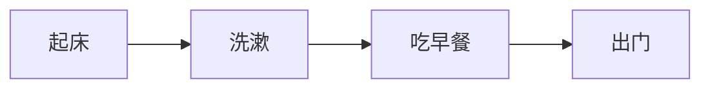
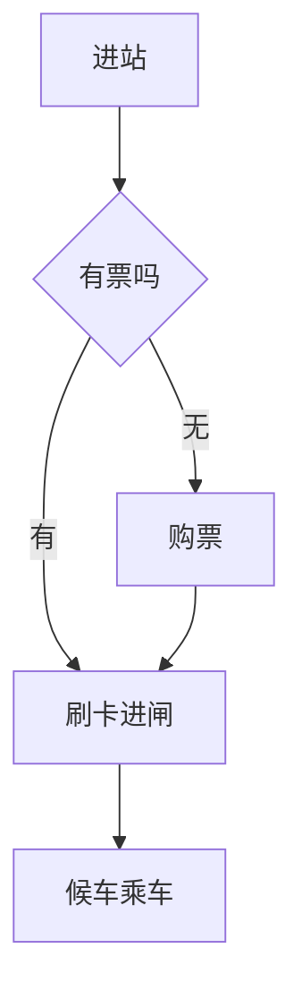
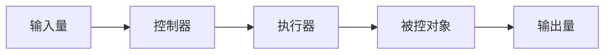
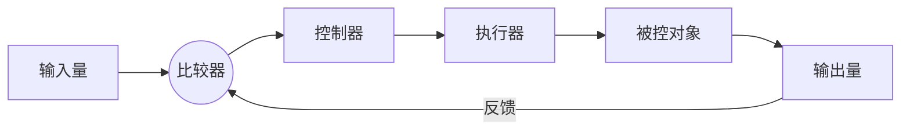

技术学考 / 选考笔记，对应通用技术必修《技术与设计2》，按章整理。

## 结构与设计

### 结构的概念

**结构**（Structure）是可承受一定力的构件的搭配和组合方式。任何物体只要能承受一定的力，都可以看作一个结构。

从力学角度看，结构是指能够承受一定载荷作用而不被破坏的组成方式。研究结构，本质是研究物体承受和传递力的能力。

- **构件**：组成结构的基本单元，如梁、柱、杆、板；
- **载荷**（Load）：作用在结构上的外力，如自重、风力、重物压力；
- 结构的功能是承受载荷、传递力、保持自身形状。

### 构件的受力

结构中的每个构件都在承受和传递力。按力的作用方式，构件的基本受力分为五种。

#### 五种基本受力

- **拉力**：构件受到方向相反、沿轴线向外的力，有被拉长的趋势；
- **压力**：构件受到方向相反、沿轴线向内的力，有被压短的趋势；
- **弯曲力**：构件受到与轴线垂直的力，有被弯折的趋势；
- **剪切力**：构件受到方向相反、错位排列的一对力，有被剪断的趋势；
- **扭转力**：构件受到方向相反的两个力矩，有被扭转的趋势。

|  受力  |        受力特点        |        实例        |
| :----: | :--------------------: | :----------------: |
|  拉力  | 沿轴线向外，有伸长趋势 | 起重机的吊索、拉杆 |
|  压力  | 沿轴线向内，有压缩趋势 |  房屋的立柱、桥墩  |
| 弯曲力 | 垂直于轴线，有弯折趋势 |  横梁、跳水的跳板  |
| 剪切力 | 一对错位力，有剪断趋势 | 剪刀剪纸、螺栓连接 |
| 扭转力 |  一对力矩，有扭转趋势  | 拧毛巾、汽车传动轴 |

判断受力时，先看力的方向与构件轴线的关系：沿轴线向外是拉、向内是压；垂直轴线是弯；错位一对是剪；成对力矩是扭。

#### 应力与强度

构件受力时，内部各部分之间产生相互作用力，用 **应力**（Stress）$\sigma$ 表示单位面积上的内力：

$$\sigma=\frac{F}{S}$$

其中 $F$ 为构件横截面上的内力，$S$ 为横截面面积。载荷相同时，横截面越大，应力越小，构件越不易破坏。

**强度**（Strength）指结构抵抗被外力破坏的能力。影响强度的因素：

- **材料**：材料本身的力学性质，如钢材强度高于木材；
- **形状**：截面形状影响承载能力，工字形、管状比实心更省料；
- **连接方式**：铰连接、刚连接对强度影响不同。

### 结构的稳定性

**稳定性**（Stability）指结构在载荷作用下维持原有平衡状态的能力。稳定性是结构设计的首要考虑。

#### 影响因素

- **重心位置**：重心越低，结构越稳定。降低重心可增强稳定性；
- **支撑面大小**：支撑面（结构与地面接触形成的面）越大，越稳定。重心的垂线落在支撑面内则不倒；
- **结构形状**：三角形具有稳定性，四边形易变形。上小下大、上轻下重的结构更稳定。

结论：重心低、支撑面大、重心垂线落在支撑面内，三者共同决定稳定性。不倒翁不倒，是因为重心极低且始终位于支撑点正上方内侧。

#### 稳定与强度的区别

|      |       稳定性       |        强度        |
| :--: | :----------------: | :----------------: |
| 含义 | 维持平衡状态的能力 |   抵抗破坏的能力   |
| 关注 | 结构是否倾覆、倒塌 | 构件是否断裂、变形 |
| 影响 | 重心、支撑面、形状 |  材料、形状、连接  |

稳定性差的结构会整体倾覆，强度不足的结构会局部破坏，二者需分别校核。

### 结构的类型

按结构的形态和受力特点，常见结构分为三类。

- **实体结构**：由整块材料构成，如实心墙、堤坝、砖块。外力作用在整个体积上，承压能力强；
- **框架结构**：由细长构件通过连接组合而成，如铁塔、脚手架、自行车架。质轻、材料省、内部空间大；
- **壳体结构**：外力作用在薄壳表面上，如安全帽、贝壳、蛋壳、汽车外壳。曲面分散受力，轻而坚固。

|   类型   |      受力特点      |      实例      |
| :------: | :----------------: | :------------: |
| 实体结构 | 外力分布在整个体积 |  大坝、承重墙  |
| 框架结构 |   外力沿杆件传递   | 铁塔、桥梁桁架 |
| 壳体结构 | 外力分布在薄壳表面 |  安全帽、穹顶  |

三角形是框架结构的基本稳定单元。在四边形框架上加一根对角斜杆，可将其分成两个三角形，从而大幅提升稳定性。

### 结构的连接

构件之间的连接方式影响结构的强度与稳定性，常见分为两类。

- **铰连接**：被连接构件之间可以相对转动，如门的合页、活动扳手。承受载荷时接头处可转动；
- **刚连接**：被连接构件之间不能相对转动，如榫接、焊接、螺栓紧固。连接牢固，整体性强。

选择连接方式时，需要转动的部位用铰连接，需要固定的部位用刚连接。

### 经典结构欣赏

赏析一个结构，从技术与文化两方面入手。

- **技术角度**：受力是否合理、材料是否恰当、连接是否牢固、稳定性与强度是否兼顾；
- **文化角度**：造型是否美观、是否体现时代与地域特色、是否与环境协调。

如赵州桥采用敞肩拱，既减轻自重又增大泄洪能力；埃菲尔铁塔用框架结构，上小下大、重心低，兼顾稳定与轻盈。

### 简单结构设计

结构设计要在满足功能的前提下，兼顾强度、稳定性、美观与成本。设计的一般步骤：

1. 明确设计要求，确定结构的功能和载荷；
2. 构思结构方案，选择结构类型与材料；
3. 分析受力，校核强度与稳定性；
4. 绘制草图，制作模型；
5. 测试改进，优化方案。

设计时权衡各因素：强度不足则加固或换材料，稳定性差则降低重心、扩大支撑面，成本过高则简化结构、减少用料。

## 流程与设计

### 流程的含义

**流程**（Process）是一系列活动按照一定的时间和逻辑顺序组成的过程。流程包含两个基本要素。

- **环节**：完成任务所经历的若干活动阶段；
- **时序**：各环节之间先后进行的顺序。

时序和环节共同构成流程。改变时序或环节，流程随之改变，结果也可能不同。如洗衣服的「加水—放衣—加洗涤剂」与「加洗涤剂—加水—放衣」，环节相同而时序不同。

- 有些环节的时序不可颠倒（先烧水后泡茶）；
- 有些环节可以并行（烧水的同时准备茶叶）；
- 合理安排时序能提高效率。

### 流程的表达

流程常用 **流程图**（Flowchart）表达。流程图用图形符号和箭头，清晰表示环节和时序。

流程图的优点：直观、清晰，便于分析和交流。绘制时按时序从左到右或从上到下排列环节，用箭头连接。

对于有条件判断的流程，可加入判断分支。如乘坐地铁：

### 流程分析

流程分析是理解流程内在规律的过程，主要分析两方面。

- **环节分析**：流程有哪些环节，各环节的目的和作用；
- **时序分析**：各环节的先后顺序是否合理，能否调整。

分析流程时关注：哪些环节必需、哪些可省略、哪些可合并、哪些能并行、时序能否优化。

### 流程设计与优化

流程设计要考虑内外因素，在满足目标的前提下追求高效、经济、安全。

设计流程的一般步骤：

1. 明确流程的目标和任务；
2. 分解任务，确定环节；
3. 分析各环节的时序关系；
4. 绘制流程图，检查合理性。

**流程优化**是在原有流程基础上，通过调整环节和时序使流程更合理。优化的常见方向：

| 优化方向 |        做法        |    效果    |
| :------: | :----------------: | :--------: |
| 工期优化 | 合并环节、并行处理 | 缩短总时间 |
| 成本优化 | 减少环节、节省材料 |  降低成本  |
| 质量优化 |    增设检验环节    |  提高质量  |
| 技术优化 | 引入新工艺、新设备 |  提升水平  |

优化需权衡：并行能省时但可能增加资源占用，增设检验能提质但会增加环节。目标不同，优化方向不同。

## 系统与设计

### 系统的含义

**系统**（System）是由相互联系、相互作用的若干部分组成的、具有特定功能的有机整体。构成系统需要满足三个条件。

- 至少由两个或两个以上的要素（部分）组成；
- 要素之间相互联系、相互作用；
- 各要素按一定方式构成整体，具有特定功能。

如自行车由车架、车轮、传动、制动等部分组成，各部分协同工作实现行驶功能，是一个系统。

### 系统的基本特性

系统具有五个基本特性，是分析和设计系统的依据。

- **整体性**：系统是一个整体，整体功能大于各部分功能之和。部分服从整体，不能孤立看待某一部分；
- **相关性**：系统内各要素相互联系、相互制约，一个要素变化会影响其他要素；
- **目的性**：系统都有其特定目的，要素的组合服务于系统目标；
- **环境适应性**：系统存在于一定环境中，要能适应外部环境的变化；
- **动态性**：系统随时间不断变化发展，处于动态平衡之中。

|    特性    |       含义       |         例子         |
| :--------: | :--------------: | :------------------: |
|   整体性   | 整体大于部分之和 | 木桶盛水由最短板决定 |
|   相关性   |   要素相互影响   |   换大齿轮影响车速   |
|   目的性   |  系统有特定目标  |  交通系统为通行服务  |
| 环境适应性 |   适应外部环境   |   生物适应气候变化   |
|   动态性   |    随时间变化    |     生态系统演替     |

其中整体性是系统最基本的特性。木桶原理体现整体性：木桶的容量由最短的一块木板决定，改善短板才能提升整体。

### 系统分析

**系统分析**是从系统整体出发，对系统的构成、功能、目标进行分析，寻求最优方案的过程。系统分析应遵循三条原则。

- **整体性原则**：从整体出发，局部服从整体，追求整体最优而非局部最优；
- **科学性原则**：分析要有科学依据，用数据和事实说话；
- **综合性原则**：综合考虑各种因素和相关要素，全面权衡。

系统分析的一般步骤：明确问题、收集资料、建立模型、分析比较、评价选优。

### 系统的优化

**系统优化**是在给定条件下，使系统达到最佳目标的过程。优化要处理好局部与整体的关系。

- 追求整体最优，而非各局部最优的简单相加；
- 局部最优不等于整体最优，有时需牺牲局部保全整体；
- 优化受人力、物力、财力、时间等条件约束。

如城市交通优化，不能只考虑某一路口的通行，而要统筹全城路网，才能实现整体畅通。

### 简单系统设计

系统设计要从整体出发，统筹各要素，实现系统的预定功能。设计的一般步骤：

1. 明确系统的目标和功能；
2. 分析系统的构成要素及其关系；
3. 拟定系统方案，确定各要素及连接方式；
4. 评价优化，检验系统整体功能。

设计时把握整体性：先确定整体目标，再分解到各部分；各部分之间协调配合，避免相互冲突。

## 控制与设计

### 控制的含义

**控制**（Control）是指人们按照一定目的，通过一定手段使事物向预期目标发展的过程。控制在生产生活中广泛存在。

- 按控制方式分为 **人工控制** 和 **自动控制**；
- 按有无反馈分为 **开环控制** 和 **闭环控制**。

如手动调节水龙头是人工控制，自动感应水龙头是自动控制。控制的核心是让被控对象的输出达到预期目标。

### 控制系统的组成

一个控制系统一般由输入、控制器、执行器、被控对象、输出五部分组成。

- **输入量**：控制系统的预期目标值，即希望达到的状态；
- **控制器**：对输入信号进行处理，发出控制指令的部分；
- **执行器**：接收控制器指令，直接作用于被控对象的部分；
- **被控对象**：控制系统所要控制的对象；
- **输出量**：被控对象实际达到的状态，即控制的结果。

### 开环控制

**开环控制**（Open-loop Control）指控制系统的输出不影响输入，没有反馈环节的控制。信号单向传递。

开环控制结构简单、成本低、反应快，但不能纠正干扰造成的偏差，控制精度低。如普通的红绿灯按固定时间切换，不管路口车流多少。

### 闭环控制

**闭环控制**（Closed-loop Control）指系统的输出通过反馈影响输入，具有反馈环节的控制。

- **反馈**（Feedback）：把输出量的信息返回到输入端，与输入量比较的过程；
- **比较器**：将反馈信号与输入信号比较，得出偏差，据此调整控制。

闭环控制能根据偏差自动调整，控制精度高、抗干扰能力强，但结构复杂、成本高。如空调根据室温反馈自动启停，恒温箱、自动跟踪等都是闭环控制。

#### 开环与闭环对比

|        |      开环控制      |      闭环控制      |
| :----: | :----------------: | :----------------: |
|  反馈  |         无         |         有         |
|  精度  |         低         |         高         |
| 抗干扰 |         弱         |         强         |
|  结构  |        简单        |        复杂        |
|  成本  |         低         |         高         |
|  实例  | 定时红绿灯、自动门 | 恒温空调、自动跟踪 |

判断开环还是闭环，关键看有无反馈：输出信息返回输入端参与调整的是闭环，否则是开环。

### 干扰与反馈

**干扰**（Disturbance）指除输入量以外，对系统输出产生影响的各种因素，如外界温度变化、电压波动、摩擦阻力。

- 开环控制无法克服干扰，干扰会直接反映在输出上；
- 闭环控制通过反馈检测偏差，自动调整以克服干扰。

反馈是闭环控制的核心。按作用分为：

- **负反馈**：反馈信号削弱输入的作用，使输出趋于稳定（多数控制系统采用）；
- **正反馈**：反馈信号增强输入的作用，使输出偏离加剧。

### 简单控制系统的设计

设计控制系统，先明确控制目标，再确定控制方式和各组成部分。一般步骤：

1. 明确被控对象和控制目标；
2. 确定采用开环还是闭环控制；
3. 确定输入量，选择控制器、执行器；
4. 若为闭环，设置检测反馈环节；
5. 绘制控制框图，测试优化。

设计时权衡：对精度要求不高、干扰小的场合用开环，简单经济；对精度要求高、干扰大的场合用闭环，可靠稳定。绘制控制框图时，标清各环节名称和信号流向，闭环需画出反馈回路。
