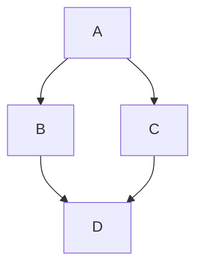

import BrowserWindow from '@site/src/components/BrowserWindow';
import IframeWindow from '@site/src/components/BrowserWindow/IframeWindow';
import Desmos from '@site/src/components/BrowserWindow/Desmos';

# 功能测试

网站的新功能测试……

## 选项

- [ ] 任务一
- [x] 任务二
- [ ] 任务三

## 折叠

<details>
<summary>参考代码</summary>

```jsx
<Tabs
  defaultValue="apple"
  values={[
    {label: 'Apple 1', value: 'apple'},
    {label: 'Orange 1', value: 'orange'},
    {label: 'Banana 1', value: 'banana'},
  ]}>
  <TabItem value="apple" label="Apple 2">
    This is an apple 🍎
  </TabItem>
  <TabItem value="orange" label="Orange 2">
    This is an orange 🍊
  </TabItem>
  <TabItem value="banana" label="Banana 2" default>
    This is a banana 🍌
  </TabItem>
</Tabs>
```

</details>

## 窗口

<BrowserWindow>
  This is a browser window.
</BrowserWindow>

## 网页

<IframeWindow url="https://generals.io" />

## Desmos

<Desmos url="https://www.desmos.com/calculator/mjjhvujgos?embed" />

## Diagrams


