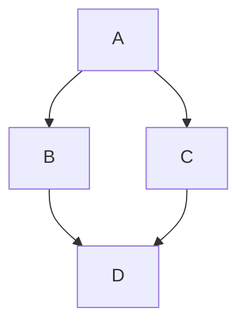

```mdx-code-block
import BrowserWindow from '@site/src/components/BrowserWindow';
```

# 测试

<details>
<summary>参考代码</summary>

```jsx
<Tabs
  defaultValue="apple"
  values={[
    {label: 'Apple 1', value: 'apple'},
    {label: 'Orange 1', value: 'orange'},
    {label: 'Banana 1', value: 'banana'},
  ]}>
  <TabItem value="apple" label="Apple 2">
    This is an apple 🍎
  </TabItem>
  <TabItem value="orange" label="Orange 2">
    This is an orange 🍊
  </TabItem>
  <TabItem value="banana" label="Banana 2" default>
    This is a banana 🍌
  </TabItem>
</Tabs>
```

</details>

```mdx-code-block
<BrowserWindow>
  <iframe src="https://www.baidu.com" />
</BrowserWindow>
```


