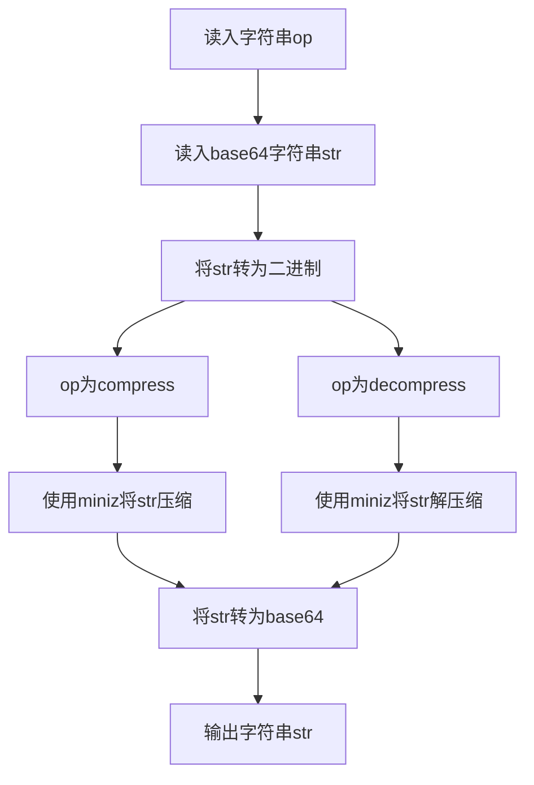

# 项目

项目板块汇集了丰富的资源和实践成果，包括实用的模板，全面的网站索引，以及各类编程项目和学习资料。

无论是学习还是开发，这里都能为你提供灵感和支持，助你在不同领域中高效前行。

```mermaid
graph TD;
    读入字符串op-->读入base64字符串str;
    读入base64字符串str-->将str转为二进制;
    将str转为二进制-->op为compress;
    将str转为二进制-->op为decompress;
    op为compress-->使用miniz将str压缩;
    op为decompress-->使用miniz将str解压缩;
    使用miniz将str压缩-->将str转为base64;
    使用miniz将str解压缩-->将str转为base64;
    将str转为base64-->输出字符串str;
```
